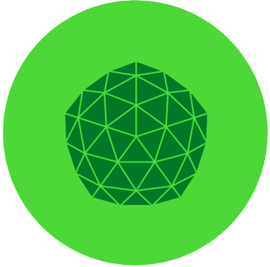

<div align="center">



# ziviDomeLive 2.0.0

**Creative-coding infrastructure for real-time fulldome, spherical and immersive rendering in Processing 4.**

[](CHANGELOG.md)
[](https://processing.org/)
[](https://adoptium.net/)
[](https://vicvalentim.github.io/ziviDomeLive/)
[](https://doi.org/10.5281/zenodo.15671506)
[](LICENSE)

[Documentation](https://vicvalentim.github.io/ziviDomeLive/) ·
[Installation](#installation) ·
[Examples](#examples) ·
[API levels](#public-api-levels) ·
[Release notes](docs/en/release-notes/2.0.0.md) ·
[Citation](#citation)

</div>

---

> [!IMPORTANT]
> **2.0.0 is the next major release line and is currently untagged.** The public 2.0 contract is frozen in this branch, but the `v2.0.0` tag must not be created until the release-evidence ledger is complete. The latest published stable tag remains [v1.5.0](https://github.com/vicvalentim/ziviDomeLive/releases/tag/v1.5.0). Capability, automated coverage and physical platform qualification are reported separately.

## Overview

ziviDomeLive lets one Processing scene feed conventional perspective, fulldome fisheye, 2:1 equirectangular and skybox representations in real time. It coordinates scene activation, spherical calibration, preview routing and optional NDI, Syphon or Spout publication while keeping ordinary sketch code close to Processing.


The library is intended for artists, creative coders, planetarium practitioners, researchers, educators, students, developers, VJs and installation teams working with real-time immersive media.

### Statement of need

Processing makes real-time graphics approachable, but a production fulldome workflow still has to solve several concerns at once: render a scene consistently across several spherical views, avoid updating simulation once per cubemap face, calibrate the projection, manage scene resources, and route frames without blocking the OpenGL thread. ziviDomeLive provides one Processing-oriented contract for that boundary.

The project focuses on **monoscopic spherical and fulldome image production**. It is not a headset runtime, stereoscopic VR engine, projection-mapping suite or general dependency-injection framework.

## What you can create

| Workflow | Representation | Typical use |
|---|---|---|
| Standard | Perspective render | Processing window, conventional display, development preview |
| Domemaster | Circular fisheye | Dome playback, lens/projector calibration, planetarium work |
| Equirectangular | 2:1 spherical image | 360° media workflows and spherical inspection |
| Skybox | Cubemap layout | Face/orientation inspection and compatible pipelines |

`RenderMode.FULL` keeps preview and external-output `ViewType` routes independent. A dedicated render mode temporarily chooses one effective representation without erasing the saved routes.

## Why 2.0

Version 2.0 preserves the teachable `Scene` model and deliberately breaks with unsafe 1.x implementation exposure:

- the facade is `ziviDomeLive`; the Java package remains `com.victorvalentim.zividomelive`;
- `Scene.sceneRender(PGraphicsOpenGL)` is the only required scene method;
- mutation belongs in `Scene.update()`, exactly once per Processing frame;
- activation-scoped services replace global or scene-owned runtime machinery;
- outputs are typed, opt-in and independently routed;
- renderer, OpenGL, UI, worker and pipeline implementations are internal;
- no deprecated 1.x compatibility API remains in the 2.0 public surface.

<details>
<summary><strong>Rendering architecture in one paragraph</strong></summary>

Standard rendering stays independent. When a spherical representation is needed, the library captures six cubemap faces into a native GPU cubemap and derives Domemaster, Equirectangular and Skybox as sibling projections. The capture and projection machinery is internal; artist code selects results with `RenderMode` and `ViewType`.

</details>

## Quickstart

```java
import com.victorvalentim.zividomelive.*;
import processing.opengl.PGraphicsOpenGL;

ziviDomeLive dome;

void settings() {
  size(1280, 720, P3D);
  pixelDensity(1);
}

void setup() {
  dome = new ziviDomeLive(this);
  dome.setup();
  dome.setScene(new MainScene());
  dome.setRenderMode(RenderMode.DOMEMASTER);
}

void draw() {
  // ziviDomeLive renders from its registered Processing hook.
}

class MainScene implements Scene {
  float angle;

  public void update() {
    angle += 0.01; // exactly once per Processing frame
  }

  public void sceneRender(PGraphicsOpenGL pg) {
    pg.background(8, 12, 24);
    pg.lights();
    pg.rotateY(angle);
    pg.box(180);
  }
}
```

> [!WARNING]
> `sceneRender()` can run more than once in a frame because spherical capture draws multiple cubemap faces. Do not advance physics, timelines, counters or shared randomness there. The library owns `beginDraw()` and `endDraw()` for the supplied target.

## The Scene contract

| Callback | Requirement | Responsibility |
|---|---:|---|
| `configure(SceneServices)` | Optional | Receive fresh activation-scoped services before setup |
| `setupScene()` | Optional | Initialize state for the current activation |
| `update()` | Optional | Advance mutable state once per Processing frame |
| `sceneRender(PGraphicsOpenGL)` | **Required** | Draw the already-updated state |
| `keyEvent(...)`, `mouseEvent(...)` | Optional | Receive raw Processing input after named actions |
| `dispose()` | Optional | Release scene-owned resources for this activation |
| `getName()` | Optional | Supply a diagnostic/display name |

Activation order is deterministic:

```text
services → configure → setup → frame/input callbacks → stop activation work → dispose → release services
```

A reload is a complete dispose/setup cycle with fresh `SceneServices`, even when the same Java `Scene` instance is reused.

## Public API levels

The 2.0 API is organized by teaching level and stability, not by the Java `public` modifier alone.

| Level | Audience and promise | Public types |
|---|---|---|
| **Stable** | Normal Processing sketches; smallest recommended path | `ziviDomeLive`, `StandardOutputAspectMode`, `Scene`, `SceneManager`, `RenderMode`, `ViewType`, `LogMode` |
| **Advanced Stable** | Projects needing lifecycle-aware time, tasks, assets, actions, camera, environment, ports, typed outputs or reusable math | `SceneServices`, `FrameClock`, `SimulationTimeline`, `SceneTaskGroup`, `SceneAssets`, `SceneActionMap`, `SceneCameraService`, `SceneEnvironmentService`, `ScenePorts`, `SceneInputPort`, `SceneOutputPort`, `OutputManager`, `OutputType`, `OutputState`, `Quaternion`, `SphericalOrientation`, `OrbitCamera` |
| **Experimental** | Measurement and qualification; source compatibility may change in a major/minor revision | `PerformanceMode`, `PerformanceMetric`, `PerformanceSnapshot`, `MetricStatistics`, `GraphicsCapabilities`, `GpuTimerPolicy`, `GpuTimerBackend`, `GpuTimerArchitecture` |
| **Processing callbacks** | Public only because Processing/ControlP5 discovers or invokes them | `pre`, `draw`, `post`, `keyEvent`, `mouseEvent`, `pause`, `resume`, `stop`, `dispose`, `controlEvent` on the facade |
| **Internal** | Renderer graph, OpenGL targets, UI, queues, workers and output producers; not callable API | Physical `_internal/` source categories and package-private implementation types |

There is **no deprecated level in 2.0**. Removed 1.x symbols are recorded in the [migration history](docs/en/api/deprecated.md) and changelog, not kept as permanent aliases.

### SceneServices, progressively

`SceneServices` belongs to one activation and exposes focused services:

| Accessor | Use |
|---|---|
| `applet()` | Owning Processing applet |
| `frameClock()` | Monotonic per-frame time |
| `timeline()` | Bounded fixed-step simulation |
| `tasks()` | Bounded keyed background work with frame-boundary callbacks |
| `assets()` | Activation-aware Processing images, shaders and shapes |
| `actions()` | Named key/mouse actions while retaining raw callbacks |
| `camera()` | Scene-space orbit camera, input and target tracking |
| `environment()` | Activation-owned environment overrides |
| `ports()` | Bounded optional external-message adapters |
| `requestReload()` | Deferred reload at a safe frame boundary |

Scenes do not construct or close these services. Background tasks must not call Processing/OpenGL APIs; their results are published only to the activation that submitted them.

## Rendering, calibration and routing

### RenderMode versus ViewType

- `RenderMode` answers **how the runtime should work now**: `FULL`, `STANDARD`, `DOMEMASTER`, `EQUIRECTANGULAR` or `SKYBOX`.
- `ViewType` answers **which final representation a destination receives**: `STANDARD`, `DOMEMASTER`, `EQUIRECTANGULAR` or `SKYBOX`.

The declaration order of `ViewType` is part of the 2.0 contract because the ControlP5 panel maps choices by index.

### Spherical calibration

Pitch, yaw and roll orient the shared spherical domain. Domemaster FOV controls angular coverage; Size% fits the circular image to the physical lens/projector path and is not scene-camera zoom. Output resolution changes are deferred to a safe render boundary.

### External outputs

Outputs start disabled and must be enabled explicitly through the typed `OutputManager` API:

```java
import com.victorvalentim.zividomelive.manager.OutputManager;

OutputManager outputs = dome.getOutputManager();
outputs.setViewForOutput(
    OutputManager.OutputType.NDI,
    ViewType.EQUIRECTANGULAR);
outputs.setOutputEnabled(OutputManager.OutputType.NDI, true);

println(outputs.getOutputState(OutputManager.OutputType.NDI));
println(outputs.getOutputFailureReason(OutputManager.OutputType.NDI));
```

Syphon is macOS-only, Spout is Windows-only, and NDI requires a separately installed NDI Runtime. Code-path availability is not evidence that a receiver/platform combination passed physical qualification.

## Built-in controls

| Input | Action |
|---|---|
| `h` | Show/hide the ControlP5 panel |
| `m` | Cycle the configured preview `ViewType` |
| Left / Right | Switch scenes when text input is inactive |

Visible ControlP5 controls own pointer gestures. A scene camera must not orbit or zoom through the same gesture.

## Requirements

| Requirement | 2.0 contract |
|---|---|
| Processing | Processing 4; automated dependencies currently use Processing core 4.5.6 |
| Renderer | `P3D` / `PGraphicsOpenGL` |
| Java source build | Java 17 |
| Pixel density | `pixelDensity(1)` for deterministic target dimensions |
| Graphics | OpenGL 4.1-capable context; packaged projection shaders use GLSL 4.10 |
| High resolutions | Dedicated GPU recommended for 3K/4K and shader-heavy scenes |

The target is macOS, Windows and Linux for core rendering, with platform-specific optional outputs. The exact `tested.platform` and `tested.processingVersion` release fields remain blank until the [2.0 evidence ledger](maintainer/release-evidence.md) is complete. This is intentional: a supported design is not the same as a qualified release configuration.

**Documentation last updated:** 2026-08-23.
**Processing `library.keywords`:** fulldome, spherical rendering, domemaster, immersive media, creative coding, Processing, OpenGL, planetarium, NDI, Syphon, Spout, real-time graphics.

## Dependencies

| Dependency | Purpose | Distribution |
|---|---|---|
| ControlP5 2.2.6 | Built-in runtime controls | Processing dependency |
| Syphon for Processing 4.0 | macOS GPU texture sharing | Processing dependency |
| Spout for Processing 2.0.8.0 | Windows GPU texture sharing | Processing dependency |
| Devolay 2.2.0-vic.2 | Java/JNI NDI sender integration | Bundled Maven artifact; NDI Runtime is separate |

See [Dependencies](docs/en/installation/dependencies.md), [NDI Runtime](docs/en/installation/ndi.md), [Known Issues](docs/en/known-issues.md) and [Third-party notices](THIRD_PARTY.md).

## Installation

### Processing Contribution Manager

After the 2.0 package is published:

1. Open **Sketch → Import Library… → Manage Libraries…**.
2. Search for **ziviDomeLive**.
3. Install it and restart Processing if requested.
4. Open **File → Examples → Contributed Libraries → ziviDomeLive**.

### Release package

For manual installation, download the release artifact rather than GitHub's repository source archive:

- [`ziviDomeLive.zip`](https://github.com/vicvalentim/ziviDomeLive/releases/latest/download/ziviDomeLive.zip)
- [`ziviDomeLive.pdex`](https://github.com/vicvalentim/ziviDomeLive/releases/latest/download/ziviDomeLive.pdex)
- [`ziviDomeLive.txt`](https://github.com/vicvalentim/ziviDomeLive/releases/latest/download/ziviDomeLive.txt)

The three files intentionally share a basename and release directory. The ZIP/PDEX contains `library/`, `reference/index.html`, `examples/`, `src/`, `library.properties`, licenses and notices in the structure expected by Processing.

### Source build

```bash
git clone https://github.com/vicvalentim/ziviDomeLive.git
cd ziviDomeLive
./gradlew clean test build
```

Source development uses Gradle and is not the normal artist installation path.

## Examples

| Level | Sketch | Focus |
|---|---|---|
| Foundation | `EmptyProject` | Minimal one-scene template |
| Foundation | `Basic` | Two scenes, switching and render modes |
| Foundation | `SphereParticle` | Lifecycle-safe background simulation |
| Advanced | `InfiniteBackground` | Translation-invariant environment |
| Advanced | `FulldomePBR` | Retained geometry, shaders and scene camera |
| Advanced | `SolarSystem` | Time, assets, actions, camera tracking and double-precision orbital simulation |
| Qualification | `CalibrationTool` | Orientation, projection and dome calibration |
| Qualification | `BenchmarkTool` | Reproducible performance evidence |

Browse [`examples/`](examples/) or the [examples guide](https://vicvalentim.github.io/ziviDomeLive/en/examples/basic/).

## Documentation and verification

The documentation system has distinct authorities:

1. implementation and tests define what exists;
2. the frozen public API and generated Javadocs define callable signatures;
3. MkDocs teaches installation, use, architecture and qualification;
4. historical pages and the changelog explain migration without redefining 2.0.

```bash
./gradlew clean test build
./gradlew qualificationTests
python3 tools/validate_documentation.py --root .
mkdocs build --strict
./gradlew buildReleaseArtifacts
```

Headless tests cover public API shape, lifecycle, routing, math, metadata, package structure and documentation contracts. GPU image quality, projector/lens behavior and NDI/Syphon/Spout receiver interoperability remain manual, environment-specific qualification.

## Research and artistic context

ziviDomeLive is developed as open-source research software and a technical-artistic research artifact at the intersection of creative coding, immersive media, fulldome, real-time audiovisual systems, artistic research and education.

The project is developed by **[Victor Valentim](https://victorvalentim.com/)**. Repository metadata records the following affiliations:

- CECULT/UFRB — Federal University of Reconcavo da Bahia;
- PPGARTES/UFMG — Federal University of Minas Gerais;
- ORCID: [0000-0002-0282-7947](https://orcid.org/0000-0002-0282-7947).

The documentation includes a [research-software and JOSS-readiness map](docs/en/research-software.md). It aligns verifiable software evidence with review criteria; it does **not** claim that ziviDomeLive has been submitted to or accepted by JOSS.

## Citation

If ziviDomeLive contributes to academic research, artistic research, teaching, software studies, publications, artworks or technical reports, cite the software using [`CITATION.cff`](CITATION.cff).

**Software DOI:** [10.5281/zenodo.15671506](https://doi.org/10.5281/zenodo.15671506)

Release maintainers must verify the registered external record before tagging or changing the DOI metadata.

## Contributing and support

Bug reports, documentation improvements, tests, examples and scoped code contributions are welcome. Read the [Contributing Guide](docs/en/contributing.md) for contract and validation requirements. Use [GitHub Issues](https://github.com/vicvalentim/ziviDomeLive/issues) for reproducible problems and support questions.

Development is supported through [GitHub Sponsors](https://github.com/sponsors/vicvalentim); sponsorship does not change the open availability of the library, documentation or public development.

## History

The repository preserves the architectural history from the original 1.x renderer through the final 1.5.0 consolidation and the deliberate 2.0 public-surface reset. See the detailed [CHANGELOG](CHANGELOG.md), [2.0 release notes](docs/en/release-notes/2.0.0.md) and [removed 1.x migration map](docs/en/api/deprecated.md).

## License

ziviDomeLive is distributed under **[GPL-2.0-only](LICENSE)**. Bundled components and calibration assets are recorded in [`THIRD_PARTY.md`](THIRD_PARTY.md).

Copyright © 2024–2026 Victor Valentim.
