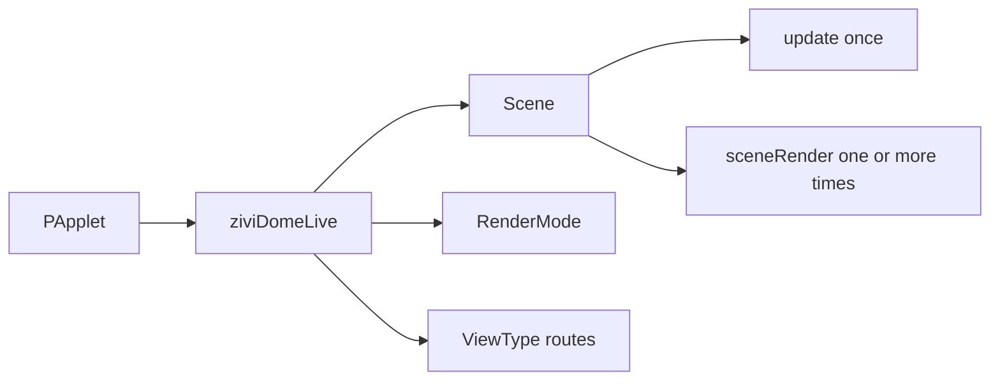

# Artist API Map

Choose the shallowest level that completely solves the work. A larger project can adopt one advanced service without adopting all of them.

- :material-application-braces-outline: **Runtime**

    Construct `ziviDomeLive`, call `setup()`, then configure scenes and representations.

- :material-palette-outline: **Scene**

    Mutate in `update()` and draw in `sceneRender()`.

- :material-view-dashboard-outline: **Representation**

    Use `RenderMode` for the working mode and `ViewType` for destination routing.

- :material-layers-triple-outline: **Optional depth**

    Adopt `SceneServices` only for time, tasks, assets, actions, camera, environment or ports.

## The normal path

## Stable controls by intention

| Intention | Start with |
|---|---|
| Activate one scene | `setScene(scene)` |
| Register several scenes | `registerScene(scene)` and `getSceneManager()` |
| Choose the runtime mode | `setRenderMode(mode)` |
| Choose the preview representation | `setCurrentView(view)` |
| Calibrate spherical orientation | `setPitch`, `setYaw`, `setRoll`, `resetOrientation` |
| Fit a domemaster | `setFov`, `setFishSize` |
| Change output resolution | `resetGraphics(resolution)`; allocation is deferred |
| Configure the scene camera | `getSceneCamera()` or `SceneServices.camera()` |
| Configure optional outputs | `getOutputManager()` |

## When to enter Advanced Stable

| Need | Service/type |
|---|---|
| Monotonic frame timing | `FrameClock` |
| Bounded fixed-step simulation | `SimulationTimeline` |
| Background calculation without OpenGL | `SceneTaskGroup` |
| Images, shaders and retained shapes | `SceneAssets` |
| Named input actions | `SceneActionMap` |
| Orbit input or tracked target | `SceneCameraService` / `OrbitCamera` |
| Activation-owned environment | `SceneEnvironmentService` |
| Optional MIDI/OSC/device adapter | `ScenePorts` SPI |

!!! info "The public facade remains authoritative"
    Prefer facade-owned scene registration. The facade prepares fresh services before every activation setup and releases them after scene disposal.

!!! warning "Never call the internal graph"
    There is no public renderer/GL/output-producer layer in 2.0. Select a final representation; do not construct cubemap targets or call renderer passes.

[Scene contract](scene-interface.md){ .md-button .md-button--primary }
[API levels](overview.md){ .md-button }
[Generated Javadocs](javadocs.md){ .md-button }

