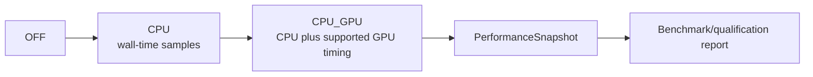

# Experimental API

The experimental public layer reports performance and graphics capabilities for qualification. It does not expose the profiler implementation, raw OpenGL timer queries or mutable metric buffers.

## Types

| Type | Role |
|---|---|
| `PerformanceMode` | `OFF`, `CPU` or `CPU_GPU` request |
| `PerformanceMetric` | Named measurement vocabulary |
| `PerformanceSnapshot` | Read-only captured session data |
| `MetricStatistics` | Aggregated sample/call/fps/percentile/threshold statistics |
| `GraphicsCapabilities` | Read-only renderer/vendor/version and feature report |
| `GpuTimerPolicy` | Safe backend-selection policy |
| `GpuTimerBackend` | Effective GPU timing mechanism |
| `GpuTimerArchitecture` | Detected architecture family used by policy |

## Measurement levels

`CPU_GPU` is a request, not a guarantee. Inspect `getEffectiveMode()`, `hasGpuTimings()`, the selected backend and diagnostics before interpreting values.

## Interpretation rules

- CPU wall time includes host scheduling effects; GPU elapsed time measures a different execution domain.
- Percentiles describe the retained bounded sample window, not an infinite history.
- Capability flags say what the active context reports, not that a feature passed visual qualification.
- Benchmark evidence must record version/commit, Processing/Java, OS, CPU/GPU, resolution, routes, warm-up, duration and metric mode.

Use [BenchmarkTool](../qualification/benchmark-guide.md) for reproducible qualification. Do not build scene behavior that depends on an experimental metric name.
