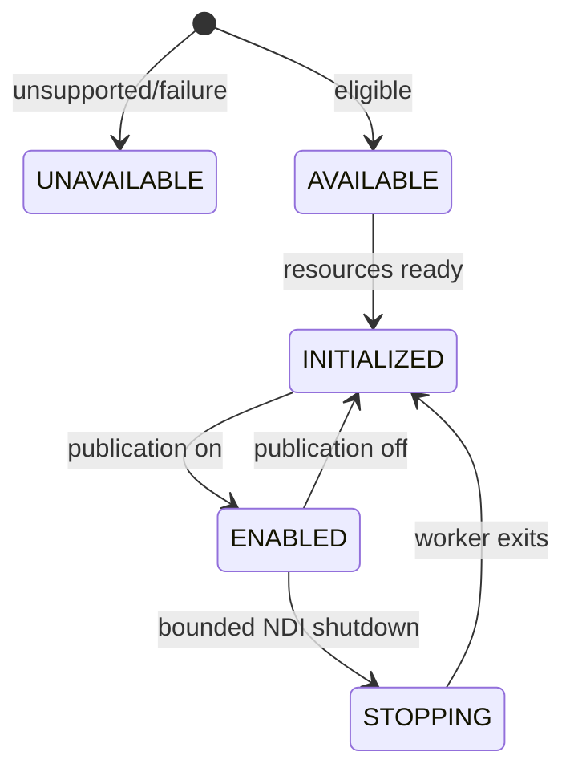

# Outputs API

`OutputManager` is an Advanced Stable, typed control interface returned by `ziviDomeLive.getOutputManager()`. Outputs start disabled.

```java
OutputManager output = dome.getOutputManager();
output.setViewForOutput(OutputManager.OutputType.NDI, ViewType.EQUIRECTANGULAR);
output.setOutputEnabled(OutputManager.OutputType.NDI, true);
```

## OutputType

The exact order is `NDI`, `SPOUT`, `SYPHON`. Use the enum, never backend-name strings.

## OutputState



`getOutputState(type)` and `getOutputFailureReason(type)` are the diagnostic authority. UI state or `setOutputEnabled` intent does not prove receiver success.

## Routing

`setViewForOutput(type, view)` is the uniform selector. `setNdiView`, `setSpoutView` and `setSyphonView` are typed convenience methods in the final 2.0 contract. Local texture availability/name/view report the platform-local route; there is no public producer or texture/FBO handle.

`RenderMode.FULL` uses stored per-destination routes. A dedicated mode temporarily overrides the effective view without deleting them.

## Backpressure and shutdown

NDI capture crosses GPU → CPU on the render thread, then uses bounded latest-frame-wins publication on a dedicated worker. Captured, sent, dropped and failed counters are observable. Normal disable does not join the worker on the OpenGL thread; terminal shutdown may use a bounded wait.

Syphon and Spout remain platform-local GPU texture-sharing routes. All external outputs require end-to-end receiver qualification.

## Deliberately absent

Public API does not expose `sendOutput`, renderer targets, pipeline requirements, resolution notifications, backend shutdown, raw workers or string-based toggles. The facade and internal producer side own them.
