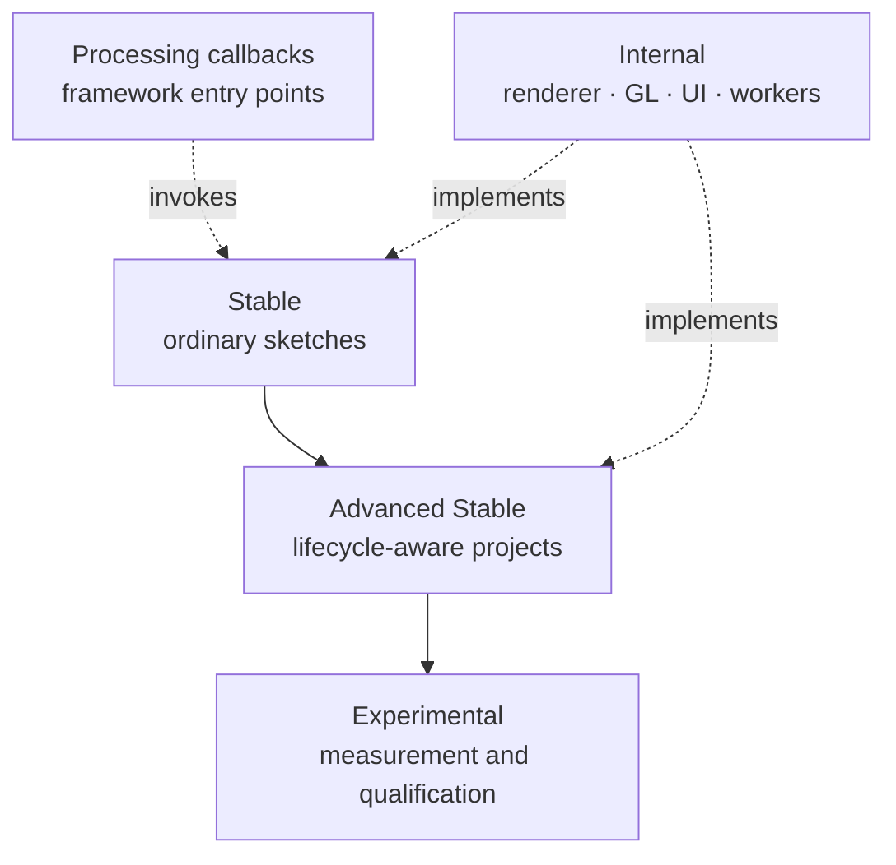

# API Overview

ziviDomeLive 2.0 has a deliberately small creative entry point and progressively exposes more control. The levels below are part of the documentation contract and are enforced against the Java surface by automated tests.

## Level 1 — Stable

The recommended API for ordinary Processing sketches:

| Type | Role |
|---|---|
| `ziviDomeLive` | Runtime facade, scene ownership, configuration and Processing integration |
| `ziviDomeLive.StandardOutputAspectMode` | Standard-output aspect policy |
| `Scene` | Extension contract; only `sceneRender(PGraphicsOpenGL)` is required |
| `SceneManager` | Registration and identity-based scene switching |
| `RenderMode` | Current runtime working mode |
| `ViewType` | Representation routed to a destination |
| `LogMode` | Debug/release logging policy |

Start here and stay here unless a concrete project need points to the next level.

## Level 2 — Advanced Stable

Supported public contracts for lifecycle-aware or technically demanding projects:

- activation services: `SceneServices`, `FrameClock`, `SimulationTimeline`, `SceneTaskGroup`, `SceneAssets`, `SceneActionMap`, `SceneCameraService`, `SceneEnvironmentService`, `ScenePorts`, `SceneInputPort`, `SceneOutputPort`;
- output control: `OutputManager`, `OutputType`, `OutputState`;
- reusable math/navigation: `Quaternion`, `SphericalOrientation`, `OrbitCamera`.

Advanced stable means callable and supported, not scene-owned. Services supplied by the runtime cannot be constructed or closed by a sketch.

## Level 3 — Experimental

The reporting/qualification layer consists of `PerformanceMode`, `PerformanceMetric`, `PerformanceSnapshot`, `MetricStatistics`, `GraphicsCapabilities`, `GpuTimerPolicy`, `GpuTimerBackend` and `GpuTimerArchitecture`.

Experimental metrics are useful evidence, but their vocabulary may evolve faster than the creative API. CPU wall time and GPU elapsed time are not interchangeable.

## Processing callback surface

`pre`, `draw`, `post`, `keyEvent`, `mouseEvent`, `pause`, `resume`, `stop` and `dispose` are public facade methods because Processing invokes them. They are integration entry points, not a second API that sketches should forward manually.

Neither `Scene` nor the facade exposes a ControlP5 callback type. The built-in panel registers its listener internally; scenes receive Processing key/mouse callbacks or use `SceneActionMap`.

## Internal boundary

Renderer implementations, cubemap targets, final-frame containers, Processing/GL adapters, UI managers, queues, executors and output producers are package-private implementation. Physical `_internal/` folders categorize them for maintenance without changing their package-private collaboration model.

!!! warning "No visibility inference"
    A class name in architecture prose is not permission to instantiate it. Only the types listed in the Stable, Advanced Stable and Experimental sections are public 2.0 API.

## No deprecated 2.0 surface

The final 2.0 contract contains no `@Deprecated` compatibility layer. Old 1.x entry points are described on the [Removed 1.x API](deprecated.md) page strictly for migration and historical preservation.

For exact methods, constructors and return types, use the [generated Javadocs](javadocs.md). `PublicApiCompatibilityTest` is the executable freeze.
