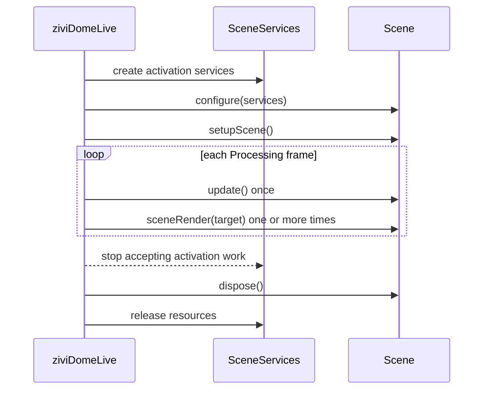

# Scene Interface

Only `sceneRender(PGraphicsOpenGL)` is required. The complete legal shape is:

```java
class ExampleScene implements Scene {
  public void configure(SceneServices services) {}
  public void setupScene() {}
  public void update() {}

  public void sceneRender(PGraphicsOpenGL pg) {
    // Draw only; the library owns beginDraw()/endDraw().
  }

  public void keyEvent(processing.event.KeyEvent event) {}
  public void mouseEvent(processing.event.MouseEvent event) {}
  public void dispose() {}
  public String getName() { return "Example"; }
}
```

`Scene` has no ControlP5 callback in 2.0.

## Activation sequence



The same instance can be activated again. `dispose()` ends one activation; it does not assert that the Java object is permanently dead.

## Update once, render many

Spherical capture can invoke `sceneRender()` for several cubemap faces after one `update()`. Physics, animation time, counters, input-derived mutation and shared randomness belong in `update()`.

Rendering must read already-published state. If face-specific randomness is desired, derive it deterministically without mutating state shared by later faces.

## Target ownership

- the library calls `beginDraw()` and `endDraw()`;
- do not retain the callback target as scene-owned graphics state;
- create/load Processing or GPU assets on the render thread, normally through `SceneAssets`;
- background tasks must not touch Processing/OpenGL.

## Input order

Named `SceneActionMap` bindings run before the corresponding raw `Scene.keyEvent` or `Scene.mouseEvent`. Built-in camera navigation is routed afterward, to exactly one camera, unless a visible ControlP5 control owns the gesture.

Avoid performing the same operation in both an action binding and raw callback.

## Deactivation paths

Switch, index selection, reload, manager replacement, clear, pause-related cleanup and terminal facade disposal preserve the same ownership order. Fresh `SceneServices` isolate old tasks, queues, ports, actions and environment state from a new activation.
