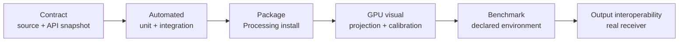

# Testing and Qualification

ziviDomeLive uses layered evidence because headless Java tests, a real OpenGL context, a projector and an external receiver answer different questions. Passing a lower layer never implies that a higher one passed.



## Evidence levels

| Level | Question answered | Primary evidence | What it does not prove |
|---|---|---|---|
| Contract | Does documentation describe the source that exists? | API snapshot, Javadocs, documentation validator | Runtime correctness |
| Automated | Are deterministic lifecycle, math, routing and metadata invariants preserved? | JUnit and Gradle qualification suites | GPU image quality or hardware support |
| Package | Can an artist install and use the released Processing artifact? | ZIP/PDEX structure check and clean-sketchbook run | Projection quality on every GPU |
| GPU visual | Are orientation, seams, calibration and environment behavior correct? | CalibrationTool captures and observation record | Performance or receiver interoperability |
| Benchmark | What performance was observed under a declared workload? | BenchmarkTool report with warm-up and environment | General performance on untested systems |
| Native output | Does the sender work with a named receiver/configuration? | End-to-end NDI/Syphon/Spout record | Other receivers, OS versions or networks |

## Automated contract

The repeatable baseline is:

```bash
./gradlew clean test build
./gradlew qualificationTests
python3 tools/validate_documentation.py --root .
python3 -m mkdocs build --strict
```

Tests cover the public API shape, configure-before-setup ordering, switch/reload/disposal behavior, old-activation isolation, camera/quaternion math, timeline behavior, typed output lifecycle, render-state logic, metadata and package rules. Assertions should report deterministic facts; exact test totals belong to generated CI/release evidence, not evergreen prose.

The documentation validator additionally checks bilingual page parity, local links, Processing homepage fields, API-level membership, Mermaid configuration, release-note/history completeness, research-readiness gaps and the absence of provisional raster placeholders.

## Package installation

After `./gradlew buildReleaseArtifacts`, validate the generated artifacts and then install the ZIP/PDEX into a clean Processing sketchbook:

```bash
python3 tools/validate_documentation.py \
  --root . \
  --package release/ziviDomeLive.zip \
  --release-dir release
```

Open `reference/index.html`, confirm the eight examples are discoverable and compile/run them from the installed package. A repository-classpath run is not package-installation evidence.

## GPU visual and calibration

Use [CalibrationTool](../qualification/calibration-tool.md) and representative scenes on a recorded OpenGL configuration. Inspect Standard, Domemaster, Equirectangular and Skybox views; record orientation, seams, pole behavior, dome diameter, lens offset, throw ratio and environment infinity.

Screenshots are evidence only when they identify version/commit, view, resolution, Processing/Java, OS, GPU/driver and calibration parameters. Editorial diagrams explain architecture but do not replace execution captures.

## Benchmark

Use [BenchmarkTool](../qualification/benchmark-guide.md) with declared warm-up, duration, resolution, enabled routes and metric mode. Archive the raw report before drawing conclusions. Compare like-for-like configurations and distinguish CPU wall time from GPU elapsed time.

## Native output

NDI, Syphon and Spout qualification is end-to-end. Record sender and receiver versions, OS/architecture, native runtime, network or texture-sharing path, selected `ViewType`, resolution, duration, frame behavior and shutdown result. “Backend initialized” is not receiver interoperability evidence.

## Research-quality reporting

For reproducible research or a future JOSS submission, every result should identify:

- software version and immutable commit;
- exact command or interaction protocol;
- dependency/runtime versions and hardware environment;
- input scene, view, resolution and calibration state;
- raw artifact location plus a human-readable summary;
- expected result, observed result, limitations and reviewer/date;
- whether the evidence is automated, observational or externally reproduced.

The [Research Software and JOSS Readiness](../research-software.md) page maps these artifacts to review concerns without claiming submission or acceptance.
