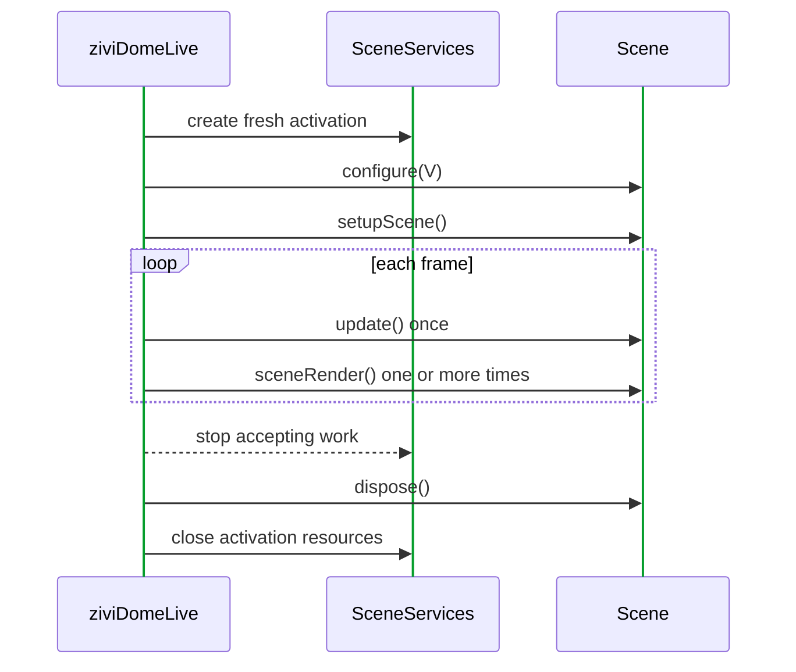
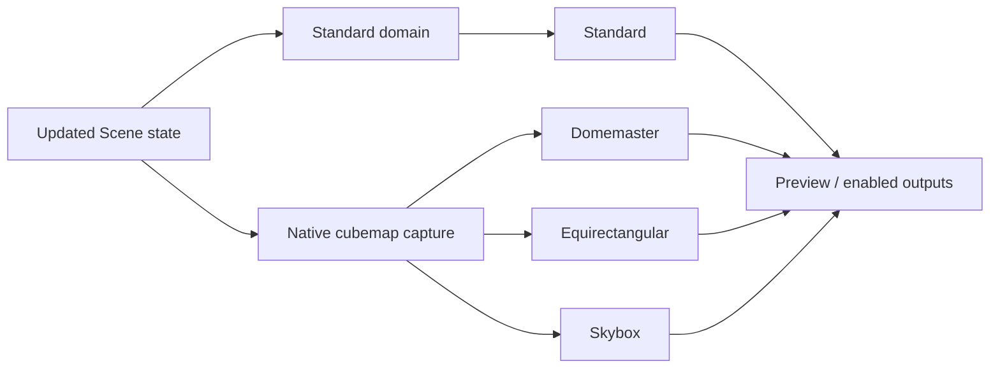

# ziviDomeLive 2.0.0 Release Notes

**Release status:** Unreleased; the API is frozen, but the release is not tagged.

Version 2.0 is the **public API and lifecycle reset** for ziviDomeLive. It keeps artist code close to Processing while internalizing renderer, OpenGL, UI, executor and output-producer machinery that 1.x allowed callers to reach.

!!! warning "Release status"
    The 2.0 source/API contract is frozen, but `v2.0.0` remains untagged until all applicable evidence gates are complete. The exact tested-platform metadata therefore remains intentionally blank.

## Release at a glance

<div class="grid cards" markdown>

- :material-palette-outline: **One required Scene method**

    `sceneRender(PGraphicsOpenGL)` remains the only abstract method. State advances in `update()` once per frame.

- :material-shield-lock-outline: **Owned lifecycle**

    Fresh activation services, bounded work and deterministic release prevent old state from leaking across reloads/switches.

- :material-cube-scan: **Native spherical domain**

    One GPU cubemap capture feeds Domemaster, Equirectangular and Skybox sibling projections.

- :material-api: **Layered API**

    Stable, Advanced Stable, Experimental, Processing Callback and Internal boundaries are explicit and tested.

</div>

## Compatibility statement

2.0 is intentionally not source-compatible with the full 1.x surface. The protected creative idea survives—`Scene`, registered Processing hooks, independent Standard/spherical representations and calibration—but facade casing, output control, services and implementation visibility changed.

The package name is unchanged:

```java
import com.victorvalentim.zividomelive.*;
```

The facade name changed:

```java
ziviDomeLive dome = new ziviDomeLive(this);
```

## Final API levels

| Level | Promise | Types |
|---|---|---|
| Stable | Recommended creative path | `ziviDomeLive`, `StandardOutputAspectMode`, `Scene`, `SceneManager`, `RenderMode`, `ViewType`, `LogMode` |
| Advanced Stable | Supported lifecycle-aware projects | `SceneServices` and focused services, typed `OutputManager`, `Quaternion`, `SphericalOrientation`, `OrbitCamera` |
| Experimental | Qualification/reporting vocabulary | performance/capability/timer policy types |
| Processing Callback | Framework-discovered facade hooks | pre/draw/post, input, pause/resume/stop/dispose, ControlP5 callback |
| Internal | Implementation only | renderer graph, GL targets/adapters, UI, queues/executors, backend producers |

No deprecated API remains in the final 2.0 surface.

## Scene lifecycle



Every activation path follows this order: first registration, explicit scene selection, next/previous, index selection, reload, manager replacement, clear and facade disposal.

### Rendering discipline

- physics, timeline, counters and shared randomness advance in `update()`;
- `sceneRender()` draws already-updated state and may run for several cubemap faces;
- the library owns callback-target `beginDraw()`/`endDraw()`;
- a scene must not retain the callback target as scene-owned graphics state.

### Reload discipline

Reload completely ends the current activation and supplies fresh `SceneServices` to the same scene instance. Disposed tasks/ports/actions/environment state cannot publish into the new activation.

## SceneServices

| Service | What 2.0 provides |
|---|---|
| `frameClock()` | Monotonic `double` timing, bounded delta, frame index |
| `timeline()` | Scene-controlled bounded fixed-step simulation and dropped-unit telemetry |
| `tasks()` | Bounded keyed background submission with result/error callbacks at frame boundary |
| `assets()` | Processing images, shaders and retained shapes created on the render thread |
| `actions()` | Named key/mouse actions compatible with raw Scene callbacks |
| `camera()` | Scene-space `OrbitCamera`, input and tracked target |
| `environment()` | Activation-owned background image/visibility/intensity/yaw |
| `ports()` | Bounded protocol-agnostic adapters with drop/pending telemetry |
| `requestReload()` | Deferred safe reload request |

Runtime-supplied services have no public constructors or scene-facing `close()`.

## Rendering architecture



### What changed internally

- six Processing face targets were replaced by a native `GL_TEXTURE_CUBE_MAP`;
- one reusable Processing command target renders each face into the cubemap;
- samplerCube GLSL 4.10 shaders derive the three spherical final views directly;
- Domemaster no longer depends on an equirectangular intermediate;
- internal requirement resolution avoids unused Standard/spherical passes;
- output resolution reset remains deferred to a safe draw boundary.

These are architecture facts, not callable API.

## Camera and environment

Direct drag/wheel manipulation is immediate; programmatic target/pose changes may interpolate. The 1.5 SolarSystem navigation coefficients remain the behavioral baseline.

Exactly one navigation camera receives each gesture. A visible ControlP5 widget under the pointer owns its interaction. Drag anchors are cleared across release, ownership changes, scene reload/switch, pause and terminal disposal.

The environment follows camera orientation but ignores target translation/orbit distance so it remains visually infinite. Dome pitch/yaw/roll/FOV remain separate projection controls.

## Typed outputs

```java
OutputManager output = dome.getOutputManager();
output.setViewForOutput(OutputManager.OutputType.NDI, ViewType.DOMEMASTER);
output.setOutputEnabled(OutputManager.OutputType.NDI, true);
```

- outputs start disabled;
- `OutputType` order is `NDI`, `SPOUT`, `SYPHON`;
- `OutputState` reports `UNAVAILABLE`, `AVAILABLE`, `INITIALIZED`, `ENABLED`, `STOPPING`;
- routes are stored independently and restored by `RenderMode.FULL`;
- producer methods and final-frame containers are internal;
- Devolay is `2.2.0-vic.2`; the NDI Runtime is still installed separately.

NDI uses bounded latest-frame-wins slots and a dedicated sender worker. Normal disable does not join native network work on the OpenGL thread; terminal disposal may wait for a bounded interval. Syphon/Spout remain GPU-native platform routes.

## Processing/ControlP5 integration fix

The facade now owns the public `controlEvent(ControlEvent)` callback and routes it to the internal UI. `Scene.controlEvent` was removed. This also prevents the ControlP5 Numberbox/key bridge from reaching an inaccessible internal class and keeps normal example consoles free of debug chatter unless debug logging is explicitly enabled.

## Performance work

- recurring allocations were removed from quaternion/orbit/environment/cubemap/NDI/UI frame paths;
- NDI conversion/publication uses reusable bounded slots;
- SolarSystem orbital math and time remain `double` until final `PVector` publication;
- SolarSystem uses compensated elapsed-time summation and rate-aware fixed steps for smooth very slow motion;
- SphereParticle uses primitive snapshots and bounded activation tasks;
- no external I/O runs on the OpenGL thread.

Experimental snapshots report CPU/GPU timing, percentiles, threshold counts, pass/invariant diagnostics and active GPU timer policy/backend. A requested CPU+GPU mode can fall back; consumers must inspect effective mode and diagnostics.

## Examples and qualification tools

| Sketch | 2.0 role |
|---|---|
| `EmptyProject` | Minimal one-scene template |
| `Basic` | Scene switching and render modes |
| `SphereParticle` | Bounded background simulation |
| `InfiniteBackground` | Environment infinity and orientation |
| `FulldomePBR` | Retained geometry, shaders and scene camera |
| `SolarSystem` | Full SceneServices reference application |
| `CalibrationTool` | Projection/orientation/calibration evidence |
| `BenchmarkTool` | Graphical performance evidence |

All examples keep simulation out of `sceneRender()` and rely on registered Processing hooks.

## Internal source organization

Internal production and test sources are physically categorized as output, performance, render camera/core/GL/modes, runtime, scene, support and UI. Package declarations deliberately preserve package-private collaboration. Tests reject uncategorized internal sources or renewed public engine leakage.

## Migration checklist from 1.x

1. Rename the facade type/constructor to `ziviDomeLive`.
2. Import top-level `ViewType` and update enum names.
3. Move mutable per-frame work into `update()`.
4. Remove scene-owned `beginDraw()`/`endDraw()` and render-target retention.
5. Register scenes through the facade.
6. Replace public/global thread access with `SceneServices.tasks()`.
7. Replace ControlP5 Scene callbacks with actions or facade state.
8. Replace string/generic output commands with typed `OutputType` methods.
9. Remove dependencies on concrete renderers, GL/cubemap types and frame containers.
10. Re-test reload, switch, pause/resume, resolution change and shutdown.

The [Removed 1.x API](../api/deprecated.md) page gives the symbol-level map.

## Documentation and research software

The 2.0 manual now separates creative use, advanced projects, exact API, internal architecture, qualification and history. Mermaid diagrams replace raster diagram placeholders; social cards/tags are produced by Material for MkDocs. A bilingual [research-software/JOSS readiness map](../research-software.md) documents evidence and gaps without claiming a paper submission.

Generated Javadocs are mounted once at the language-neutral `site/reference` route. English and Portuguese pages resolve that same tree with relative paths that remain valid under both the project site and pull-request preview prefixes. CI crawls exported HTML, CSS, sitemap alternates and Javadoc assets before publication, including the compatibility asset expected by the Temurin 17 default stylesheet.

## Validation scope

Automated coverage includes exact public API reflection, scene/services lifecycle, task/port isolation, camera/quaternion/timeline math, typed output behavior, render requirements, metadata, Javadocs, Processing package shape, bilingual docs, strict MkDocs and exported-site route integrity.

Manual evidence is still required for:

- Standard/Domemaster/Equirectangular/Skybox visual correctness on target GPU;
- CalibrationTool and projector/lens results;
- BenchmarkTool environment-specific results;
- NDI/Syphon/Spout receiver interoperability;
- installed-package execution of all eight sketches.

## Not in 2.0

Spherical Mirror, HDR/IBL/AO engine features, PBO/fence NDI readback, core MIDI/OSC dependencies and generic headset/stereo/XR runtime claims are not 2.0 contracts.

## Install or verify

Use the release ZIP/PDEX after the tag is published. Maintainers validate the candidate with:

```bash
./gradlew clean test build
./gradlew qualificationTests
python3 tools/validate_documentation.py --root .
python3 -m mkdocs build --strict
./gradlew attachJavadocsToSite --console=plain
python3 tools/validate_documentation.py --root . --site-dir site
./gradlew buildReleaseArtifacts
```

See the detailed [CHANGELOG](https://github.com/vicvalentim/ziviDomeLive/blob/main/CHANGELOG.md) and [Release Readiness](../qualification/2.0-release-readiness.md).
