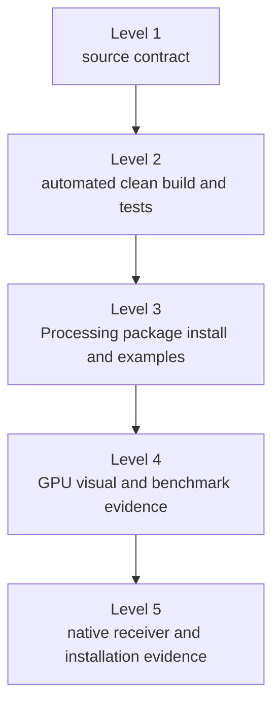

# Research Software and JOSS Readiness

ziviDomeLive is developed as open-source research software and as a technical-artistic artifact for creative coding, fulldome, immersive-media, artistic-research and education workflows.

!!! important "Readiness map, not publication status"
    This page maps repository evidence to current JOSS-style review concerns. It does not claim submission, review, acceptance, endorsement or a JOSS paper DOI.

## Statement of need

### Problem

A Processing artist who targets a dome or spherical image must coordinate multi-view capture, per-frame state consistency, projection conversion, calibration, scene/resource lifecycle and optional live publication. Implementing those boundaries independently in every sketch increases the chance of face-dependent animation, graphics-context errors, unbounded background work and output stalls.

### Audience

The primary audience is artists, creative coders, researchers, educators, students, planetarium practitioners, installation technicians, VJs and developers who want a Processing-oriented scene contract instead of a low-level rendering engine API.

### Contribution

ziviDomeLive provides:

- one scene lifecycle in which mutable state advances once and can be rendered several times;
- independent Standard and spherical rendering domains;
- final Standard, Domemaster, Equirectangular and Skybox representations;
- spherical orientation and domemaster physical calibration;
- activation-scoped time, task, asset, action, camera, environment and port services;
- typed, opt-in NDI/Syphon/Spout control with bounded runtime ownership;
- executable examples, automated qualification and target-hardware protocols.

The scholarly/technical value lies in making these constraints explicit and teachable within Processing, not in exposing an unrestricted OpenGL framework.

## State of the field

Processing supplies the creative-coding environment and OpenGL renderer; NDI, Syphon and Spout ecosystems supply transport/sharing mechanisms; fulldome production defines projection and calibration needs. ziviDomeLive composes those boundaries around a Processing `Scene` lifecycle.

A future JOSS submission still needs a peer-reviewed, cited comparison with commonly used fulldome/spherical Processing libraries and adjacent creative-coding tools, including a clear build-versus-contribute rationale. The repository does not currently present that literature comparison as complete.

## Evidence matrix

| Review concern | Repository evidence | Status for a future submission |
|---|---|---|
| Open-source license | `LICENSE`, `THIRD_PARTY.md`, packaged notices | Ready for review |
| Statement of need/audience | README and this page | Ready for review |
| Installation/dependencies | README, Installation section, Gradle/bootstrap and Processing package | Ready; installed-package evidence remains pre-tag |
| Example usage | Six learning sketches plus two qualification tools | Ready; final installed-package run remains pre-tag |
| API documentation | Public API freeze test, Javadocs, API levels, EN/PT guide | Ready for review |
| Automated tests | JUnit suites, `qualificationTests`, CI workflows | Ready; exact current totals belong to generated evidence |
| Manual scientific/visual checks | Calibration and benchmark protocols, receiver checklist | Protocol ready; hardware evidence incomplete |
| Community guidelines | Contributing guide, issue tracker, support path | Ready for review |
| Citation/authorship | `CITATION.cff`, `.zenodo.json`, DOI/ORCID metadata | External DOI record verification remains pre-tag |
| State-of-field comparison | Explicit gap above | **Not ready** |
| Research impact | Evidence policy below | **Not ready without concrete external evidence** |
| Software paper | No `paper.md` is claimed in 2.0 | **Not submitted** |

## Reproducibility levels



### Level 1 — Contract

Versioned source, exact public API snapshot, lifecycle tests, documentation validator and conservative metadata.

### Level 2 — Automated execution

Clean Java 17 build, JUnit/qualification suites, strict MkDocs build, Javadocs and deterministic release-package checks in CI.

### Level 3 — Processing distribution

Install generated ZIP/PDEX into a clean sketchbook, open `reference/index.html`, and compile/run all eight examples from the installed package.

### Level 4 — Visual/performance qualification

Record OpenGL environment, projection/view, resolution and calibration results; run BenchmarkTool with warm-up, duration and metric mode declared.

### Level 5 — External interoperability

Record the exact sender/receiver, OS, architecture, runtime, network and backend for every NDI/Syphon/Spout claim.

Lower-level success never implies a higher level.

## Research impact evidence policy

A DOI, affiliation or statement of potential use is not evidence of research impact. A future impact statement must cite concrete, verifiable material such as publications using the software, documented independent users, integration in research/teaching workflows, archived benchmark improvements or reproducible research artifacts. Until that evidence is assembled, the honest status is **incomplete**.

## Community, support and credit

- contribute code/tests/docs through the [Contributing Guide](contributing.md);
- report reproducible problems or seek public support through [GitHub Issues](https://github.com/vicvalentim/ziviDomeLive/issues);
- cite the software through [Citation](citation.md) and `CITATION.cff`;
- preserve contributor authorship/credit according to actual intellectual contribution.

## AI-assisted work disclosure for this documentation revision

The 2.0 documentation restructuring was assisted by OpenAI Codex under maintainer direction. API claims were checked against source, the executable public-API snapshot and local validation; external standards were checked against official Processing, JOSS and Material for MkDocs sources. The maintainer remains responsible for technical accuracy and release approval.

This statement covers the documentation revision. Any future JOSS paper must include its own complete disclosure of AI use in software development, documentation and paper authorship, together with the human verification procedure.

## Reviewer commands

```bash
./gradlew clean test build
./gradlew qualificationTests
python3 tools/validate_documentation.py --root .
python3 -m mkdocs build --strict
./gradlew buildReleaseArtifacts
python3 tools/validate_documentation.py \
  --root . \
  --package release/ziviDomeLive.zip \
  --release-dir release
```

GPU, projector, benchmark and receiver evidence cannot be replaced by a headless command.
