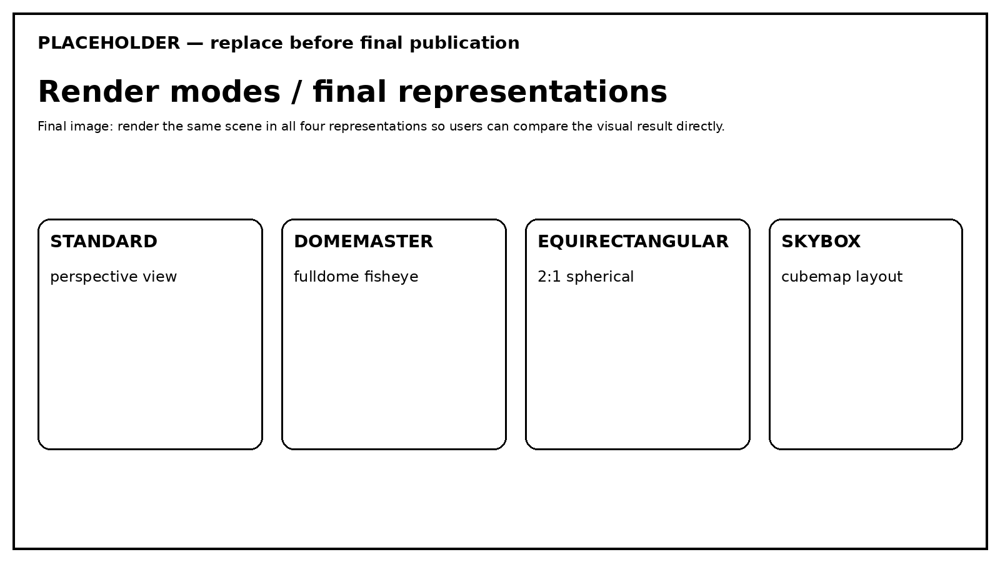

# Render Modes and View Types

ziviDomeLive separates **how the application is currently working** from **which representation a destination receives**. Keeping those two decisions distinct is the key to predictable preview/output routing.

<figure markdown="span">
  
  <figcaption>RenderMode changes the current working mode; ViewType selects the representation requested by a destination.</figcaption>
</figure>

- :material-tune-variant: **RenderMode** — *How do I want to work now?*

    `FULL`, `STANDARD`, `DOMEMASTER`, `EQUIRECTANGULAR`, `SKYBOX`

- :material-routes: **ViewType** — *What should this destination receive?*

    `STANDARD`, `DOMEMASTER`, `EQUIRECTANGULAR`, `SKYBOX`

## RenderMode: current working mode

`FULL` is the default. It preserves the independent preview and output routes configured through `ViewType`.

Dedicated modes temporarily override the effective representation. They do **not** erase the stored routes that reappear when you return to `FULL`.

!!! info "Stored routes survive dedicated modes"
    Switching to `DOMEMASTER` for calibration does not destroy the Standard preview or destination-specific `ViewType` selections stored for `FULL`.

## ViewType: destination representation

In `FULL`, each destination can request a different final representation. A Standard preview can coexist with a Domemaster NDI output, for example, without turning those destinations into the same route.

=== "Standard"
    Conventional perspective representation.

=== "Domemaster"
    Circular fisheye representation used for fulldome projection.

=== "Equirectangular"
    2:1 spherical representation for 360° workflows.

=== "Skybox"
    Cubemap-layout representation.

## One runtime, multiple modes

A render mode is not a second runtime class and does not replace the `ziviDomeLive` instance. The public model remains one runtime with multiple working modes.

[Preview and Output](visual-capture-guide.md){ .md-button .md-button--primary }
[Spherical Calibration](spherical-calibration.md){ .md-button }

