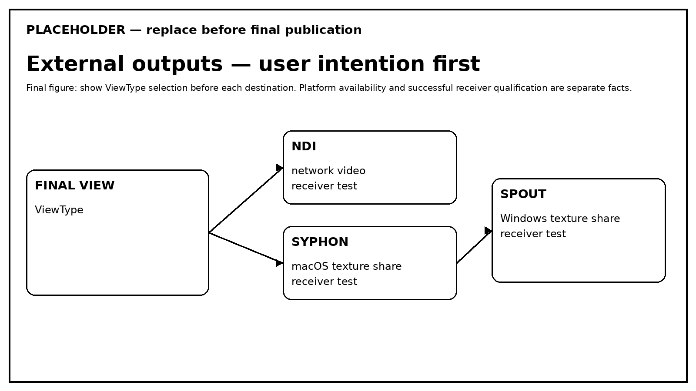

# External Outputs

External outputs are optional. First choose **which representation** a destination should receive, then enable only the backend required by the installation and verify its real receiver state.

<figure markdown="span">
  
  <figcaption>ViewType selects the representation; the backend selects how that representation leaves the application.</figcaption>
</figure>

=== "NDI"

    **What is it?** Network video output.  
    **Platform:** availability depends on compatible Devolay/NDI native runtime and receiver qualification.  
    **Select a view:** `setNdiView(ViewType...)`.  
    **Enable/disable:** `toggleOutput("ndi")`.

    ```java
    OutputManager outputs = dome.getOutputManager();
    outputs.setNdiView(ViewType.EQUIRECTANGULAR);
    outputs.toggleOutput("ndi");

    println(outputs.getOutputState(OutputManager.OutputType.NDI));
    println(outputs.getOutputFailureReason(OutputManager.OutputType.NDI));
    ```

    !!! tip "Qualification"
        Test with a real NDI receiver before marking a platform as qualified.

=== "Syphon"

    **What is it?** Platform-local GPU texture sharing on macOS.  
    **Select a view:** `setSyphonView(ViewType...)`.  
    **Enable/disable:** `toggleOutput("syphon")`.

    Availability is not the same as successful initialization or receiver qualification.

=== "Spout"

    **What is it?** Platform-local GPU texture sharing on Windows.  
    **Select a view:** `setSpoutView(ViewType...)`.  
    **Enable/disable:** `toggleOutput("spout")`.

    Test with a real receiver on the Windows configuration that will be claimed as qualified.

## State and troubleshooting

Use `getOutputState(...)` and `getOutputFailureReason(...)` to distinguish unavailable, initialized/enabled and failed states. Do not infer output health only from a UI toggle.

??? abstract "Under the hood"
    GPU/CPU boundaries, worker queues, buffers, latest-frame-wins behavior and native sharing details are documented in [Output Backends](../architecture/output-backends.md). They are not prerequisites for enabling an output.
