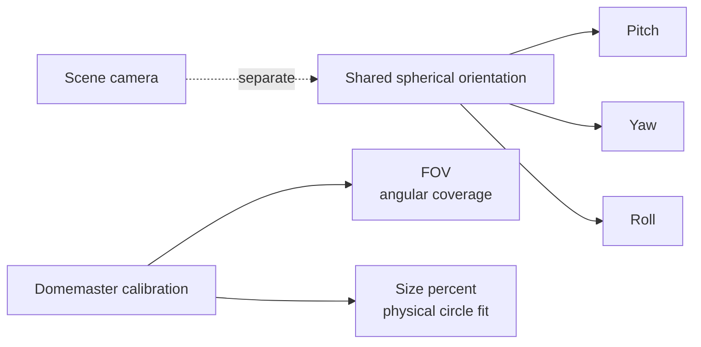

# Spherical Calibration

Pitch/Yaw/Roll, FOV and Size% solve **different calibration problems**. Keeping them separate prevents orientation, field of view and physical image fitting from being confused with Scene camera motion.

- :material-axis-arrow: **Pitch / Yaw / Roll**

    Orient the shared spherical domain. They are not the Scene Camera.

- :material-angle-acute: **FOV**

    Defines the angular field represented by Domemaster.

- :material-resize: **Size%**

    Fits the physical Domemaster circle to projector/lens geometry. It is not scene zoom.

## Recommended workflow

1. Choose Domemaster.
2. Establish Pitch/Yaw/Roll orientation.
3. Set the required Domemaster FOV.
4. Adjust Size% to the optical/projector geometry.
5. Verify the result with `CalibrationTool` on the target system.
6. Preserve the calibration while changing output resolution unless the installation itself requires recalibration.

!!! warning "Size% is not zoom"
    To move through or reframe scene content, use the Scene camera/navigation model. Size% adjusts the circular Domemaster image inside the output target.

[Camera and Navigation](camera-navigation.md){ .md-button }
[CalibrationTool](../qualification/calibration-tool.md){ .md-button .md-button--primary }

