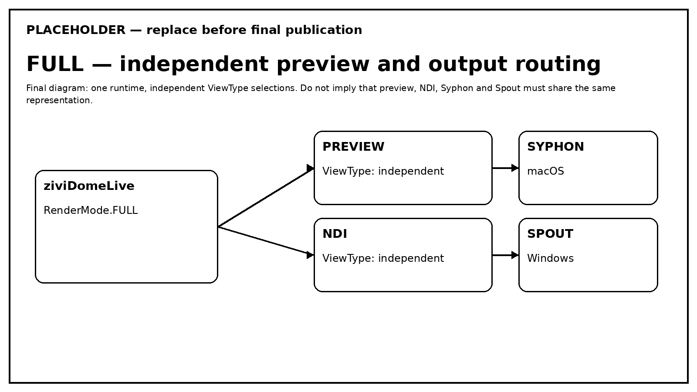

# Preview and Output

Preview and output are independent consumers of rendered views.

## Preview

- Standard preview follows the current Processing window dimensions.
- Spherical preview uses the library's automatic square preview policy rather than the output resolution.
- Resizing the window therefore does not redefine the external-output resolution.

## Output resolution

The public resize entry point is `resetGraphics(int)`. Documentation and examples must use that implemented API name.

Output-target changes are deferred to the render/draw boundary so graphics resources are recreated in the correct Processing/OpenGL context.

Changing output resolution must not silently redefine preview resolution. Domemaster Size% is calibration state and must remain persistent across output-target recreation.

## Output aspect

The final representation determines the relevant output geometry/aspect. Standard, Domemaster, Equirectangular and Skybox should be treated as distinct final views rather than as one rescaled image.

## Independent routing in FULL

`RenderMode.FULL` allows combinations such as:

- Standard preview + Domemaster NDI;
- Standard preview + Equirectangular local texture output;
- Domemaster preview + another enabled output view.

The effective route is resolved per destination. A dedicated `RenderMode` temporarily overrides effective representation without deleting the stored `ViewType` selections.
