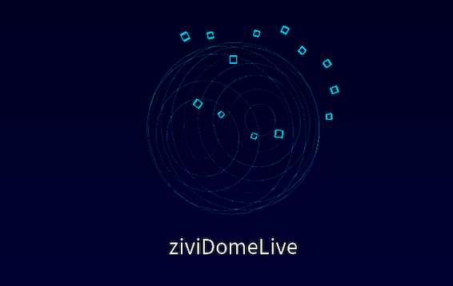

# ziviDomeLive

**ziviDomeLive** is a versatile Processing library designed to create immersive visual experiences for fulldome projections, monoscopic VR environments, and interactive installations. It provides a flexible framework to manage scenes, handle 3D rendering, and integrate external controllers or projection technologies like **Syphon** and **Spout**. With its real-time rendering capabilities, **ziviDomeLive** is ideal for planetarium displays, live audiovisual performances, and interactive installations. This documentation will guide you through installation, key features, API references, usage examples, and advanced configurations to maximize the library’s potential.

---

## Key Features

- **Multiple Projection Modes**:  
  Supports a wide range of projection formats, including **fisheye domemaster**, **equirectangular**, **cubemap**, and more. These projection modes allow you to create visuals that engage viewers by wrapping around or adapting dynamically to immersive displays, whether in VR setups or fulldome environments.

- **Resolution Switching for Domemaster**:  
  Enables seamless switching between **1k, 2k, 3k,** and **4k** resolutions for domemaster projection, ensuring sharp visuals across various dome sizes or display systems. This feature allows you to optimize performance based on your hardware and project requirements.

- **Scene Management**:  
  Organize and dynamically switch between different visual scenes with the **Scene** interface, allowing for modular compositions. Each scene can have its own setup, rendering logic, and user interactions, making it versatile for both interactive installations and live performances.

- **Real-time Rendering**:  
  Engineered for live visuals, **ziviDomeLive** is optimized for smooth frame-by-frame rendering, even with complex 3D scenes and shader effects. This feature makes it a strong choice for VJ work, live coding, and interactive art installations.

- **External Integration**:  
  Seamlessly integrates with other applications through **Syphon** (macOS) and **Spout** (Windows) to share rendered frames in real-time from Processing. This is valuable for multimedia performances, allowing visuals to be further processed or projected with other tools.

- **Interactive UI**:  
  Integrates with **ControlP5** for creating interactive controls directly in Processing, such as sliders, buttons, and toggle switches, which enable real-time manipulation of visual parameters.

- **Cross-Platform Compatibility**:  
  Runs on **macOS, Windows,** and **Linux**, ensuring accessibility and versatility across operating systems, so your visual creations can easily deploy on various platforms without compatibility issues.

- **Customizable Rendering Pipelines**:  
  Tailor rendering pipelines to your project’s specific needs, whether it’s fulldome projection or interactive environments. The library allows adjustments to rendering resolution, projection mode, and other parameters to optimize performance and visual quality.

---

## Getting Started with ziviDomeLive

To start exploring the capabilities of **ziviDomeLive**, refer to the **[Quickstart Guide](getting-started/quickstart.md)**, which introduces you to setup, installation, and essential functionality for creating dynamic, interactive visuals in Processing. For more detailed setup steps and a list of dependencies, please see the **[Installation Guide](installation/installation-steps.md)**.

**ziviDomeLive** is a flexible toolset that encourages experimentation, providing everything needed to turn your Processing sketches into immersive, interactive experiences. Dive in, explore its features, and create real-time visual displays that captivate and engage your audience in new and innovative ways.
