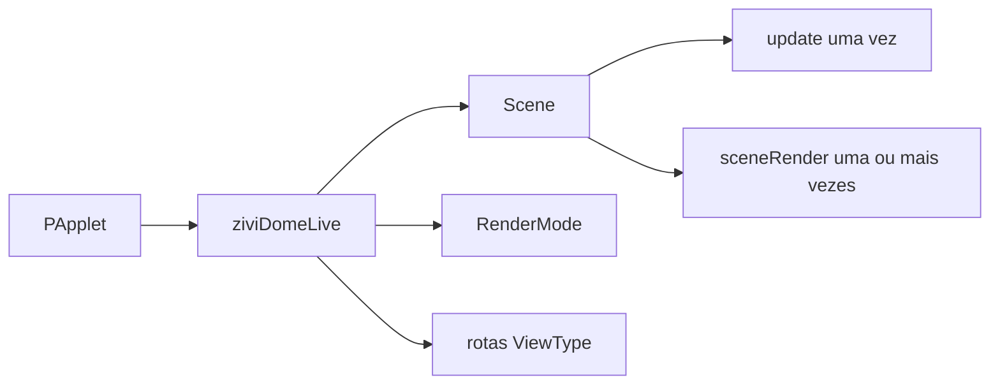

# Mapa da API para Artistas

Escolha o nível mais raso que resolva completamente o trabalho. Um projeto maior pode adotar um serviço avançado sem adotar todos.

- :material-application-braces-outline: **Runtime**

    Construa `ziviDomeLive`, chame `setup()` e configure cenas e representações.

- :material-palette-outline: **Scene**

    Faça mutação em `update()` e desenho em `sceneRender()`.

- :material-view-dashboard-outline: **Representação**

    Use `RenderMode` para o modo de trabalho e `ViewType` para o roteamento de destinos.

- :material-layers-triple-outline: **Profundidade opcional**

    Adote `SceneServices` somente para tempo, tasks, assets, actions, câmera, environment ou ports.

## O caminho normal

## Controles Stable por intenção

| Intenção | Comece com |
|---|---|
| Ativar uma cena | `setScene(scene)` |
| Registrar várias cenas | `registerScene(scene)` e `getSceneManager()` |
| Escolher o modo do runtime | `setRenderMode(mode)` |
| Escolher a representação do preview | `setCurrentView(view)` |
| Calibrar orientação esférica | `setPitch`, `setYaw`, `setRoll`, `resetOrientation` |
| Ajustar um domemaster | `setFov`, `setFishSize` |
| Alterar resolução de output | `resetGraphics(resolution)`; a alocação é adiada |
| Configurar a câmera da cena | `getSceneCamera()` ou `SceneServices.camera()` |
| Configurar outputs opcionais | `getOutputManager()` |

## Quando entrar em Advanced Stable

| Necessidade | Serviço/tipo |
|---|---|
| Tempo monotônico por frame | `FrameClock` |
| Simulação fixed-step limitada | `SimulationTimeline` |
| Cálculo em background sem OpenGL | `SceneTaskGroup` |
| Imagens, shaders e shapes retidos | `SceneAssets` |
| Actions nomeadas de input | `SceneActionMap` |
| Órbita por input ou target rastreado | `SceneCameraService` / `OrbitCamera` |
| Environment pertencente à ativação | `SceneEnvironmentService` |
| Adapter opcional MIDI/OSC/device | SPI `ScenePorts` |

!!! info "A facade pública continua autoritativa"
    Prefira registro de cenas pela facade. Ela prepara serviços novos antes de cada setup de ativação e os libera depois do descarte da cena.

!!! warning "Nunca chame o grafo interno"
    Não existe camada pública de renderer/GL/produtor de output em 2.0. Selecione uma representação final; não construa targets de cubemap nem chame passes de renderer.

[Contrato Scene](scene-interface.md){ .md-button .md-button--primary }
[Níveis da API](overview.md){ .md-button }
[Javadocs gerados](javadocs.md){ .md-button }

