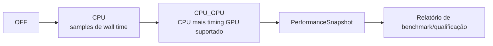

# API Experimental

A camada pública experimental reporta performance e capabilities gráficas para qualificação. Não expõe implementação do profiler, timer queries OpenGL raw ou buffers mutáveis de métricas.

## Tipos

| Tipo | Papel |
|---|---|
| `PerformanceMode` | Request `OFF`, `CPU` ou `CPU_GPU` |
| `PerformanceMetric` | Vocabulário nomeado de medição |
| `PerformanceSnapshot` | Dados read-only da sessão capturada |
| `MetricStatistics` | Estatísticas agregadas de samples/calls/fps/percentis/limiares |
| `GraphicsCapabilities` | Relatório read-only de renderer/vendor/versão/features |
| `GpuTimerPolicy` | Política segura de seleção de backend |
| `GpuTimerBackend` | Mecanismo efetivo de timing GPU |
| `GpuTimerArchitecture` | Família de arquitetura detectada usada pela política |

## Níveis de medição

`CPU_GPU` é pedido, não garantia. Inspecione `getEffectiveMode()`, `hasGpuTimings()`, o backend selecionado e diagnostics antes de interpretar valores.

## Regras de interpretação

- wall time de CPU inclui efeitos de scheduling; elapsed time de GPU mede outro domínio de execução;
- percentis descrevem a janela bounded retida, não histórico infinito;
- flags de capability dizem o que o contexto reporta, não que a feature passou qualificação visual;
- evidência de benchmark registra versão/commit, Processing/Java, OS, CPU/GPU, resolução, rotas, warm-up, duração e modo de métrica.

Use [BenchmarkTool](../qualification/benchmark-guide.md) para qualificação reprodutível. Não faça comportamento de cena depender do nome de uma métrica experimental.
