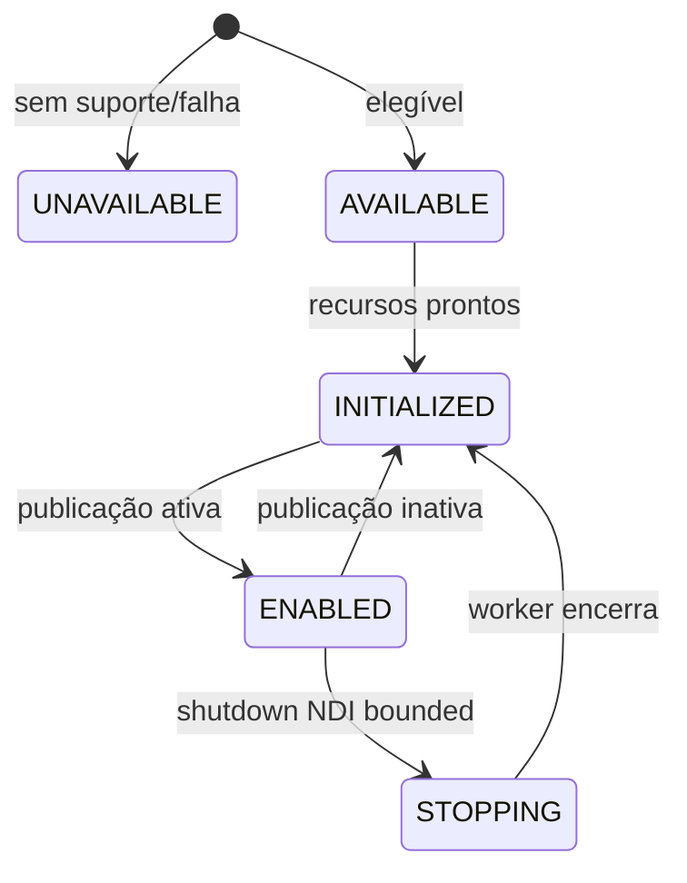

# API de Outputs

`OutputManager` é uma interface de controle tipada Advanced Stable retornada por `ziviDomeLive.getOutputManager()`. Outputs começam desabilitados.

```java
OutputManager output = dome.getOutputManager();
output.setViewForOutput(OutputManager.OutputType.NDI, ViewType.EQUIRECTANGULAR);
output.setOutputEnabled(OutputManager.OutputType.NDI, true);
```

## OutputType

A ordem exata é `NDI`, `SPOUT`, `SYPHON`. Use o enum, nunca strings com nomes de backend.

## OutputState



`getOutputState(type)` e `getOutputFailureReason(type)` são a autoridade diagnóstica. Estado da UI ou intenção em `setOutputEnabled` não prova sucesso no receiver.

## Roteamento

`setViewForOutput(type, view)` é o seletor uniforme. `setNdiView`, `setSpoutView` e `setSyphonView` são conveniências tipadas do contrato final 2.0. Disponibilidade/nome/view de textura local reportam a rota platform-local; não existe producer público nem handle de textura/FBO.

`RenderMode.FULL` usa rotas salvas por destino. Um modo dedicado substitui temporariamente a view efetiva sem apagá-las.

## Backpressure e shutdown

A captura NDI cruza GPU → CPU na render thread e usa publicação bounded latest-frame-wins em worker dedicado. Contadores de captured, sent, dropped e failed são observáveis. Disable comum não faz join do worker na thread OpenGL; shutdown terminal pode usar espera limitada.

Syphon e Spout continuam rotas platform-local de compartilhamento GPU. Todo output externo exige qualificação end-to-end com receiver.

## Deliberadamente ausente

A API pública não expõe `sendOutput`, targets de renderer, requirements do pipeline, notificações de resolução, shutdown de backend, workers raw ou toggles por string. A facade e o lado produtor interno possuem essas operações.
