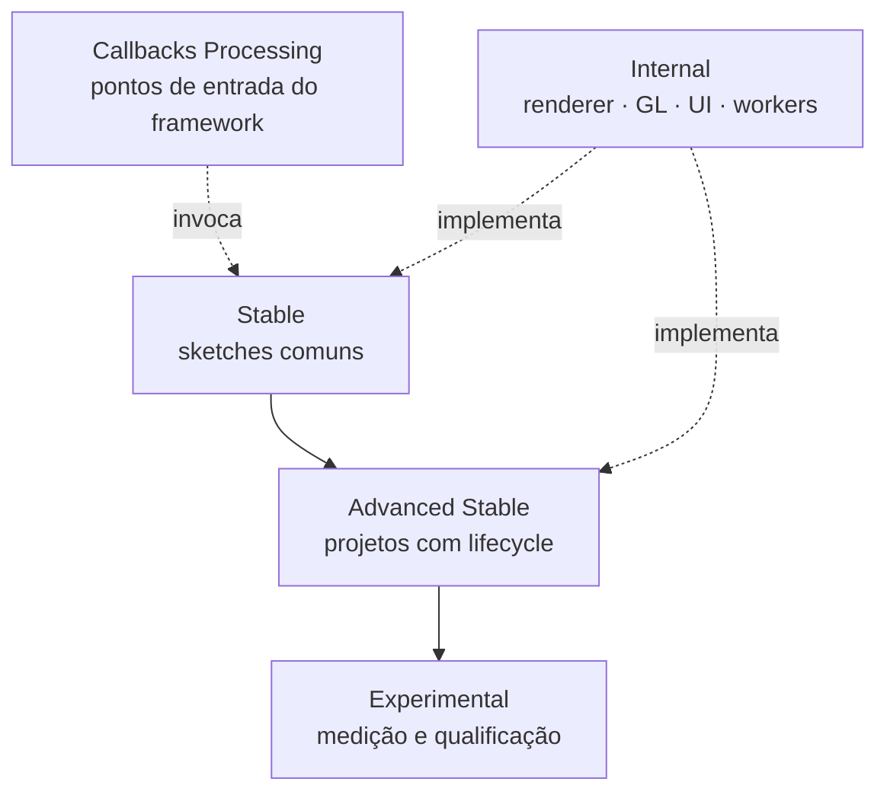

# Visão Geral da API

ziviDomeLive 2.0 possui uma entrada criativa deliberadamente pequena e libera mais controle de forma progressiva. Os níveis abaixo fazem parte do contrato documental e são verificados contra a superfície Java por testes automatizados.

## Nível 1 — Stable

API recomendada para sketches Processing comuns:

| Tipo | Papel |
|---|---|
| `ziviDomeLive` | Facade do runtime, ownership de cenas, configuração e integração Processing |
| `ziviDomeLive.StandardOutputAspectMode` | Política de aspecto do output Standard |
| `Scene` | Contrato de extensão; apenas `sceneRender(PGraphicsOpenGL)` é obrigatório |
| `SceneManager` | Registro e troca de cenas por identidade |
| `RenderMode` | Modo de trabalho corrente do runtime |
| `ViewType` | Representação roteada a um destino |
| `LogMode` | Política de logging debug/release |

Comece e permaneça aqui até uma necessidade concreta indicar o próximo nível.

## Nível 2 — Advanced Stable

Contratos públicos suportados para projetos lifecycle-aware ou tecnicamente exigentes:

- serviços de ativação: `SceneServices`, `FrameClock`, `SimulationTimeline`, `SceneTaskGroup`, `SceneAssets`, `SceneActionMap`, `SceneCameraService`, `SceneEnvironmentService`, `ScenePorts`, `SceneInputPort`, `SceneOutputPort`;
- controle de output: `OutputManager`, `OutputType`, `OutputState`;
- matemática/navegação reutilizável: `Quaternion`, `SphericalOrientation`, `OrbitCamera`.

Advanced stable significa chamável e suportado, não pertencente à cena. Serviços fornecidos pelo runtime não podem ser construídos nem fechados pelo sketch.

## Nível 3 — Experimental

A camada de reporting/qualificação contém `PerformanceMode`, `PerformanceMetric`, `PerformanceSnapshot`, `MetricStatistics`, `GraphicsCapabilities`, `GpuTimerPolicy`, `GpuTimerBackend` e `GpuTimerArchitecture`.

Métricas experimentais são evidência útil, mas seu vocabulário pode evoluir mais rapidamente que a API criativa. Tempo de parede na CPU e tempo decorrido na GPU não são intercambiáveis.

## Superfície de callbacks Processing

`pre`, `draw`, `post`, `keyEvent`, `mouseEvent`, `pause`, `resume`, `stop`, `dispose` e `controlEvent` são métodos públicos da facade porque Processing ou ControlP5 os invoca. São pontos de integração, não uma segunda API que o sketch deva encaminhar manualmente.

`Scene` deliberadamente não possui `controlEvent`. O painel ControlP5 pertence ao runtime; cenas recebem callbacks de teclado/mouse do Processing ou usam `SceneActionMap`.

## Fronteira Internal

Implementações de renderer, targets de cubemap, containers finais de frame, adapters Processing/GL, managers de UI, filas, executores e produtores de output são implementação package-private. Pastas físicas `_internal/` os categorizam para manutenção sem alterar seu modelo de colaboração package-private.

!!! warning "Não deduza pela visibilidade"
    Um nome de classe no texto de arquitetura não autoriza sua instanciação. Somente os tipos listados em Stable, Advanced Stable e Experimental são API pública 2.0.

## Nenhuma superfície deprecated em 2.0

O contrato final 2.0 não contém camada de compatibilidade `@Deprecated`. Entradas antigas de 1.x aparecem em [API 1.x Removida](deprecated.md) apenas para migração e preservação histórica.

Para métodos, construtores e retornos exatos, consulte os [Javadocs gerados](javadocs.md). `PublicApiCompatibilityTest` é o freeze executável.
