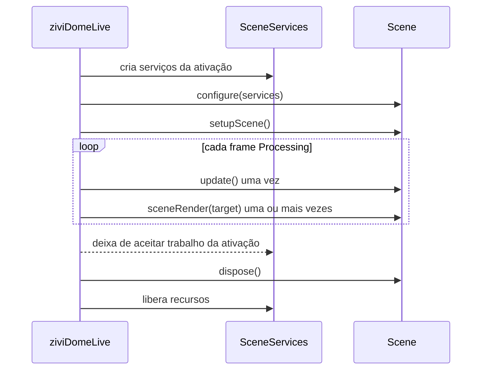

# Interface Scene

Somente `sceneRender(PGraphicsOpenGL)` é obrigatório. A forma legal completa é:

```java
class ExampleScene implements Scene {
  public void configure(SceneServices services) {}
  public void setupScene() {}
  public void update() {}

  public void sceneRender(PGraphicsOpenGL pg) {
    // Apenas desenhe; a biblioteca controla beginDraw()/endDraw().
  }

  public void keyEvent(processing.event.KeyEvent event) {}
  public void mouseEvent(processing.event.MouseEvent event) {}
  public void dispose() {}
  public String getName() { return "Example"; }
}
```

`Scene` não possui callback ControlP5 em 2.0.

## Sequência de ativação



A mesma instância pode ser ativada novamente. `dispose()` encerra uma ativação; não afirma que o objeto Java morreu permanentemente.

## Atualize uma vez, renderize várias

A captura esférica pode invocar `sceneRender()` para várias faces do cubemap depois de um único `update()`. Física, tempo de animação, contadores, mutação derivada de input e aleatoriedade compartilhada pertencem a `update()`.

O render deve ler estado já publicado. Para aleatoriedade específica de face, derive valores deterministicamente sem mutar estado compartilhado pelas faces seguintes.

## Ownership do target

- a biblioteca chama `beginDraw()` e `endDraw()`;
- não retenha o target do callback como estado gráfico da cena;
- crie/carregue assets Processing ou GPU na render thread, normalmente por `SceneAssets`;
- tasks em background não podem tocar Processing/OpenGL.

## Ordem de input

Bindings nomeados de `SceneActionMap` rodam antes do `Scene.keyEvent` ou `Scene.mouseEvent` raw correspondente. A navegação de câmera built-in é roteada depois, para exatamente uma câmera, salvo quando um controle ControlP5 visível possui o gesto.

Evite executar a mesma operação em um action binding e no callback raw.

## Caminhos de desativação

Troca, seleção por índice, reload, substituição de manager, clear, limpeza relacionada a pause e descarte terminal da facade preservam a mesma ordem de ownership. `SceneServices` novos isolam tasks, filas, ports, actions e environment antigos da nova ativação.
