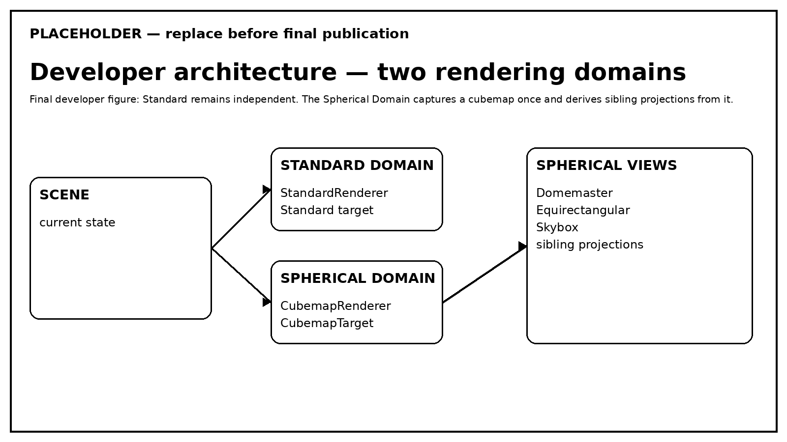

# Visão Geral da Arquitetura

ziviDomeLive 2.0 organiza a renderização em **dois domínios** que podem ser exigidos independentemente ou no mesmo frame do Processing. Essa separação é o fato arquitetural central por trás do roteamento e do reuso.

<figure markdown="span">
  
  <figcaption>A renderização Standard permanece independente; as views esféricas finais compartilham uma captura cubemap.</figcaption>
</figure>

- :material-monitor: **Standard Domain**

    `Scene` → Standard renderer → Standard final target. Nenhum cubemap esférico é necessário para trabalho apenas Standard.

    [Standard Domain →](standard-domain.md)

- :material-earth: **Spherical Domain**

    `Scene` → cubemap capture → `CubemapTarget` → Domemaster / Equirectangular / Skybox.

    [Spherical Domain →](spherical-domain.md)

## Capture once, project many, consume many

O cubemap é a captura esférica compartilhada. As projeções esféricas solicitadas devem reutilizá-lo sempre que os requisitos do frame permitirem. Consumidores de preview e output recebem views finais e não devem forçar captura duplicada da cena apenas porque vários consumidores solicitam o mesmo domínio.

!!! info "Arquitetura não é pré-requisito para criação"
    Artistas podem permanecer no nível de `Scene`, `RenderMode`, `ViewType`, câmera e calibração. Esta seção existe para contribuidores, desenvolvedores e pesquisadores que precisam dos contratos do engine.

## Continue pelo engine

- **Rendering Pipeline** — resolução de requisitos e reuso de views finais. [Abrir →](rendering-pipeline.md)
- **Backend OpenGL** — fronteira Processing/OpenGL e comportamento de recursos. [Abrir →](opengl-backend.md)
- **Lifecycle** — ownership, invalidação e shutdown. [Abrir →](runtime-lifecycle.md)
- **Backends de Output** — fronteiras internas NDI/Syphon/Spout. [Abrir →](output-backends.md)

