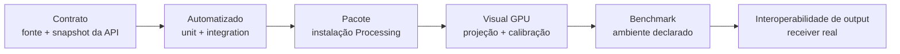

# Testes e Qualificação

ziviDomeLive usa evidência em camadas porque testes Java headless, um contexto OpenGL real, um projetor e um receiver externo respondem perguntas diferentes. Aprovar um nível inferior nunca implica aprovação do superior.



## Níveis de evidência

| Nível | Pergunta respondida | Evidência principal | O que não prova |
|---|---|---|---|
| Contrato | A documentação descreve a fonte existente? | Snapshot da API, Javadocs, validator documental | Correção em runtime |
| Automatizado | Invariantes determinísticos de lifecycle, matemática, routing e metadata foram preservados? | JUnit e suítes Gradle de qualificação | Qualidade de imagem GPU ou suporte de hardware |
| Pacote | Um artista consegue instalar e usar o artefato Processing publicado? | Check da estrutura ZIP/PDEX e execução em sketchbook limpo | Qualidade da projeção em toda GPU |
| Visual GPU | Orientação, seams, calibração e environment estão corretos? | Capturas do CalibrationTool e registro de observação | Performance ou interoperabilidade de receiver |
| Benchmark | Qual performance foi observada na carga declarada? | Relatório do BenchmarkTool com warm-up e ambiente | Performance geral em sistemas não testados |
| Output nativo | O sender funciona com uma configuração/receiver nomeado? | Registro end-to-end NDI/Syphon/Spout | Outros receivers, versões de OS ou redes |

## Contrato automatizado

O baseline repetível é:

```bash
./gradlew clean test build
./gradlew qualificationTests
python3 tools/validate_documentation.py --root .
python3 -m mkdocs build --strict
./gradlew attachJavadocsToSite --console=plain
python3 tools/validate_documentation.py --root . --site-dir site
```

Os testes cobrem forma da API pública, ordem configure-before-setup, switch/reload/disposal, isolamento da ativação anterior, matemática de câmera/quaternion, timeline, lifecycle de outputs tipados, estado de render, metadata e regras do pacote. Assertions devem registrar fatos determinísticos; totais exatos pertencem à evidência gerada de CI/release, não à prosa permanente.

O validator documental também verifica paridade bilíngue, links locais, campos da homepage Processing, membros dos níveis da API, configuração Mermaid, completude de release notes/história, gaps de prontidão científica e ausência de placeholders raster provisórios. Com `--site-dir site`, ele também percorre o HTML exportado, folhas de estilo e a rota canônica dos Javadocs, fazendo assets locais ausentes ou 404 localizados falharem na qualificação.

## Instalação do pacote

Depois de `./gradlew buildReleaseArtifacts`, valide os artefatos e instale ZIP/PDEX em um sketchbook Processing limpo:

```bash
python3 tools/validate_documentation.py \
  --root . \
  --package release/ziviDomeLive.zip \
  --release-dir release
```

Abra `reference/index.html`, confirme os oito exemplos e compile/execute cada um a partir do pacote instalado. Execução pelo classpath do repositório não é evidência de instalação.

## Visual GPU e calibração

Use [CalibrationTool](../qualification/calibration-tool.md) e cenas representativas em configuração OpenGL registrada. Inspecione Standard, Domemaster, Equirectangular e Skybox; registre orientação, seams, polos, diâmetro do domo, offset da lente, throw ratio e infinity do environment.

Capturas só são evidência quando identificam versão/commit, view, resolução, Processing/Java, OS, GPU/driver e parâmetros de calibração. Diagramas editoriais explicam arquitetura, mas não substituem capturas de execução.

## Benchmark

Use [BenchmarkTool](../qualification/benchmark-guide.md) com warm-up, duração, resolução, rotas e modo de métrica declarados. Arquive o relatório bruto antes das conclusões. Compare configurações equivalentes e diferencie wall time CPU de elapsed time GPU.

## Output nativo

A qualificação NDI, Syphon e Spout é end-to-end. Registre versões de sender/receiver, OS/arquitetura, runtime nativo, rede ou caminho de texture sharing, `ViewType`, resolução, duração, comportamento de frames e shutdown. “Backend inicializou” não é evidência de interoperabilidade.

## Relato com qualidade de pesquisa

Para pesquisa reproduzível ou futura submissão JOSS, cada resultado deve identificar:

- versão do software e commit imutável;
- comando ou protocolo de interação exato;
- versões de dependência/runtime e ambiente de hardware;
- cena, view, resolução e calibração;
- localização do artefato bruto e resumo legível;
- resultado esperado, observado, limitações, reviewer e data;
- se a evidência é automatizada, observacional ou reproduzida externamente.

A página [Software de Pesquisa e Prontidão JOSS](../research-software.md) mapeia esses artefatos para questões de review sem alegar submissão ou aceite.
