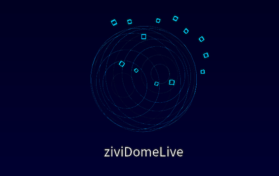

# ziviDomeLive 1.5.0

{ width="520" }

ziviDomeLive é uma biblioteca para Processing 4 voltada a gráficos fulldome, VR monoscópico e instalações imersivas em tempo real. Ela combina gerenciamento do ciclo de vida de cenas, renderização Standard e esférica independentes, calibração de domemaster e roteamento opcional por NDI, Syphon ou Spout.

A versão 1.5.0 consolida a arquitetura madura da geração 1.x. Ela preserva a fachada pública `zividomelive` e o comportamento legado de `ViewType`, adicionando `RenderMode`, requisitos de renderização centralizados, ownership previsível do lifecycle e estados observáveis para outputs.

## Comece Aqui

1. Consulte os [requisitos do sistema](installation/requirements.md) e as [dependências](installation/dependencies.md).
2. Instale o pacote seguindo os [passos de instalação](installation/installation-steps.md).
3. Crie a primeira cena com o [guia rápido](getting-started/quickstart.md).
4. Escolha entre roteamento independente e renderização dedicada em [uso básico](usage/basic-usage.md).

## Contratos Estáveis da 1.5

- `Scene.sceneRender(PGraphicsOpenGL)` recebe um target já aberto; a biblioteca controla `beginDraw()` e `endDraw()`.
- `RenderMode.FULL` é o padrão e preserva rotas independentes de preview e output.
- A renderização Standard é independente da captura cubemap esférica.
- Pitch, yaw e roll esféricos compartilham uma única fonte de orientação.
- O FOV do domemaster varia de `0..360`, com padrão `210`.
- O Size% do domemaster varia de `0..100`, com padrão `100`.
- Os presets de resolução de output são `1024`, `2048`, `3072` e `4096`.
- A publicação por outputs externos começa desabilitada.

## Domínios de Renderização

```text
STANDARD
Scene -> StandardRenderer -> target Standard

ESFÉRICO
Scene -> seis faces cubemap -> equiretangular -> domemaster
                              \-> layout cubemap
```

A topologia esférica acima continua sendo um detalhe interno da geração 1.x. Ela não obriga futuras versões major a usar `PGraphicsOpenGL[]` nem a derivar domemaster de equiretangular.

## Qualificação

A suíte Java valida API, estado, lifecycle, routing, matemática, metadata e contratos de release sem exigir GPU. Paridade visual e interoperabilidade de outputs nativos exigem o exemplo [CompatibilityLock](examples/advanced.md) em hardware qualificado. O repositório não fabrica imagens golden.

Consulte os [problemas conhecidos](known-issues.md) antes de uma implantação de produção.
