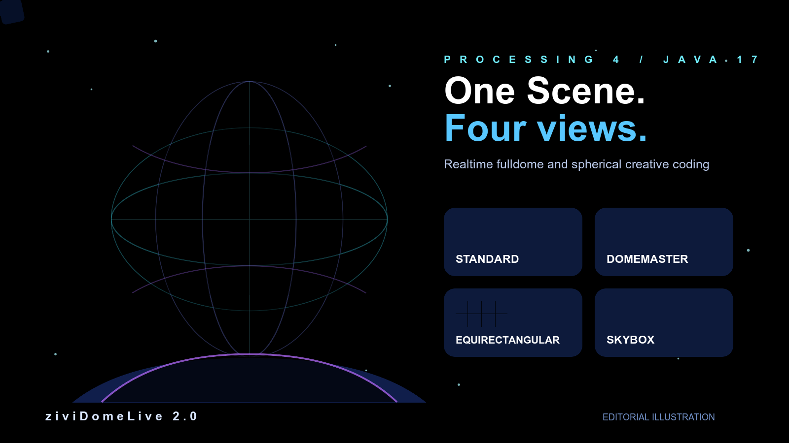

Biblioteca Processing · ziviDomeLive 2.0

# Crie para o domo, a esfera e a imagem ao vivo

Construa fluxos visuais **fulldome, esféricos e imersivos em tempo real** a partir de uma única Scene do Processing e escolha como cada preview ou output será representado.

[Comece a criar](getting-started/quickstart.md){ .md-button .md-button--primary }
[Explore a API](api/artist-api-map.md){ .md-button }

## O que posso criar?

- :material-monitor: **Standard**

    Renderização em perspectiva para a janela do Processing e outputs visuais convencionais.

- :material-fisheye: **Domemaster**

    Representação fisheye circular para projeção fulldome e calibração do domo.

- :material-earth: **Equirectangular**

    Representação esférica 2:1 para fluxos de imagem 360°.

- :material-cube-outline: **Skybox**

    Layout de cubemap para inspeção e fluxos esféricos compatíveis.

!!! tip "Comece com uma Scene"
    Um projeto básico precisa do runtime `ziviDomeLive` e de uma `Scene`. Coloque estado/simulação em `update()` e desenho em `sceneRender()`.

## Escolha seu percurso

- :material-rocket-launch-outline: **Primeiro contato com ziviDomeLive**

    Instale a biblioteca, execute o Guia Rápido e avance pelos seis exemplos de aprendizagem.

    [Abrir o Guia Rápido →](getting-started/quickstart.md)

- :material-palette-outline: **Criando uma obra ou instalação**

    Aprenda RenderMode, Preview × Output, calibração esférica, câmera/navegação e outputs externos.

    [Abrir o Guia Criativo →](usage/basic-usage.md)

- :material-api: **Programando com a biblioteca**

    Comece pelo Mapa da API para Artistas e use os Javadocs gerados para assinaturas exatas.

    [Abrir o Mapa da API →](api/artist-api-map.md)

- :material-source-branch: **Contribuindo ou pesquisando o engine**

    Estude os domínios Standard/Esférico, backend OpenGL, lifecycle, threading e fronteiras de output.

    [Abrir a arquitetura →](architecture/overview.md)

## Calibração pertence ao output, não ao zoom da cena

Pitch/Yaw/Roll orientam o domínio esférico compartilhado. O Domemaster utiliza adicionalmente FOV e Size% para adequar a representação ao sistema físico de projeção.

[Abrir Calibração Esférica](usage/spherical-calibration.md){ .md-button }

??? abstract "Por dentro"
    A versão 2.0 captura o domínio esférico em um cubemap nativo e deriva Domemaster, Equirectangular e Skybox dessa representação compartilhada. Esse detalhe de implementação pertence ao percurso de desenvolvimento; artistas podem permanecer no nível de `Scene`, `RenderMode`, `ViewType` e calibração.
