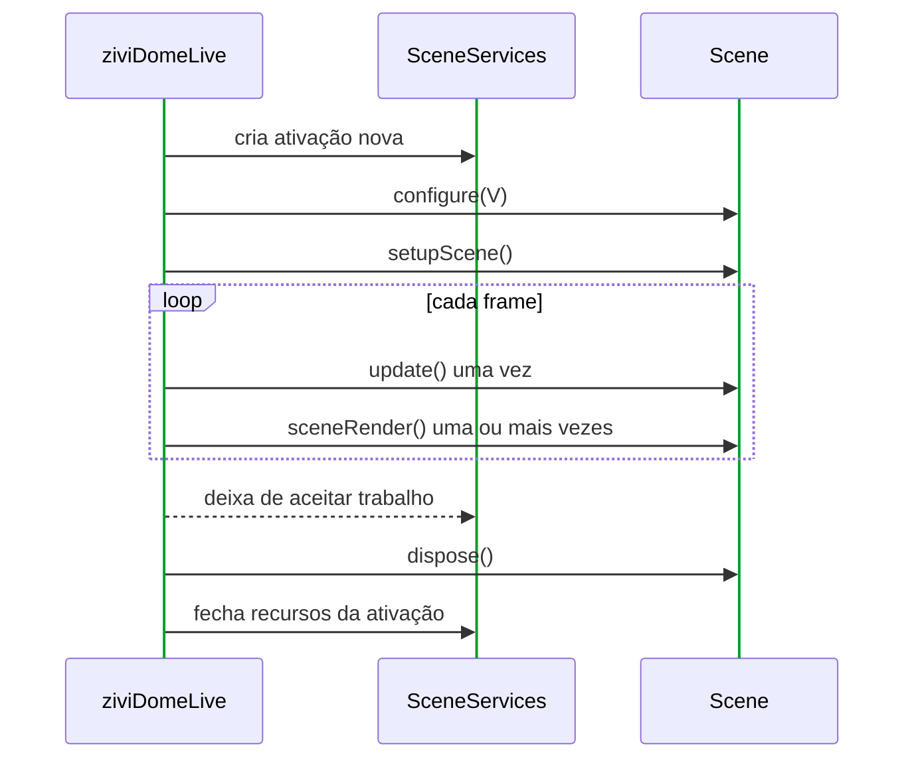
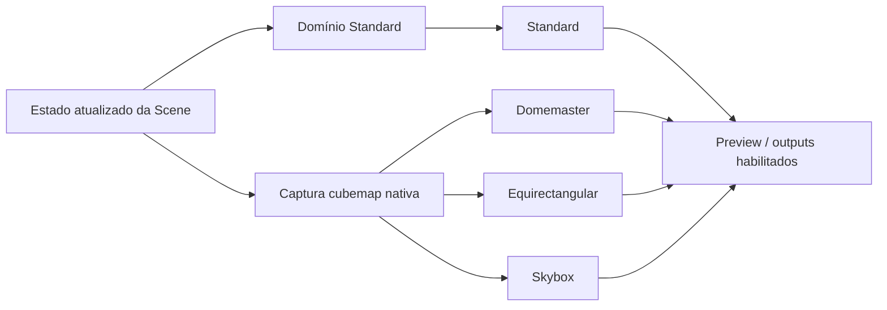

# Notas da Release ziviDomeLive 2.0.0

A versão 2.0 é o **reset da API pública e do lifecycle** do ziviDomeLive. Mantém o código artístico próximo ao Processing e internaliza renderer, OpenGL, UI, executor e producers de output que 1.x permitia alcançar.

## Licença e proveniência

O material de autoria do projeto na linha 2.0 é licenciado sob a
**Apache License 2.0 (`Apache-2.0`)**. As releases publicadas até `v1.5.0`
preservam seus termos originais `GPL-2.0-only`.

`SolarSystem` passa a registrar separadamente as camadas de proveniência:
NASA/JPL para as fontes dos dados astronômicos, Solar System Scope / INOVE sob
CC BY 4.0 para o pacote derivado de texturas planetárias/espaciais e
ESO/S. Brunier sob CC BY 4.0 para `eso0932a.jpg`. A licença do projeto não
substitui nenhum desses termos externos. Consulte a
[página de licença](../license.md) e os avisos de terceiros do repositório.

## Release em resumo

<div class="grid cards" markdown>

- :material-palette-outline: **Um método Scene obrigatório**

    `sceneRender(PGraphicsOpenGL)` é o único método abstrato. Estado avança em `update()` uma vez por frame.

- :material-shield-lock-outline: **Lifecycle com ownership**

    Serviços novos por ativação, trabalho bounded e release determinístico impedem vazamento entre reloads/trocas.

- :material-cube-scan: **Domínio esférico nativo**

    Uma captura cubemap GPU alimenta projeções irmãs Domemaster, Equirectangular e Skybox.

- :material-api: **API em níveis**

    Fronteiras Stable, Advanced Stable, Experimental, Processing Callback e Internal são explícitas e testadas.

</div>

## Declaração de compatibilidade

2.0 intencionalmente não é source-compatible com toda a superfície 1.x. A ideia criativa protegida sobrevive—`Scene`, hooks registrados, representações Standard/esférica independentes e calibração—mas casing da facade, outputs, services e visibilidade da implementação mudaram.

O package permanece:

```java
import com.victorvalentim.zividomelive.*;
```

A facade mudou:

```java
ziviDomeLive dome = new ziviDomeLive(this);
```

## Níveis finais da API

| Nível | Promessa | Tipos |
|---|---|---|
| Stable | Caminho criativo recomendado | `ziviDomeLive`, `StandardOutputAspectMode`, `Scene`, `SceneManager`, `RenderMode`, `ViewType`, `LogMode` |
| Advanced Stable | Projetos lifecycle-aware suportados | `SceneServices` e serviços focados, `OutputManager` tipado, `Quaternion`, `SphericalOrientation`, `OrbitCamera` |
| Experimental | Vocabulário de qualificação/reporting | performance/capability/timer policy types |
| Processing Callback | Hooks da facade descobertos pelo framework | pre/draw/post, input, pause/resume/stop/dispose, callback ControlP5 |
| Internal | Somente implementação | grafo de renderer, targets/adapters GL, UI, filas/executores, producers |

Não existe API deprecated na superfície final 2.0.

## Lifecycle da Scene



Todos os caminhos seguem essa ordem: primeiro registro, seleção explícita, next/previous, índice, reload, substituição do manager, clear e descarte da facade.

### Disciplina de render

- física, timeline, contadores e randomness compartilhada avançam em `update()`;
- `sceneRender()` desenha estado atualizado e pode rodar para várias faces;
- a biblioteca controla `beginDraw()`/`endDraw()` do target;
- uma cena não retém o target como estado gráfico próprio.

### Disciplina de reload

Reload encerra totalmente a ativação e fornece `SceneServices` novos à mesma instância. Tasks/ports/actions/environment descartados não publicam na nova ativação.

## SceneServices

| Serviço | O que 2.0 oferece |
|---|---|
| `frameClock()` | Tempo monotônico `double`, delta limitado, índice de frame |
| `timeline()` | Simulação fixed-step bounded controlada pela cena e telemetria de unidades descartadas |
| `tasks()` | Submissão bounded/nomeada com callbacks resultado/erro na fronteira do frame |
| `assets()` | Imagens, shaders e shapes Processing criados na render thread |
| `actions()` | Actions nomeadas de teclado/mouse compatíveis com callbacks raw |
| `camera()` | `OrbitCamera` scene-space, input, target rastreado e rig de luz de vista opt-in |
| `environment()` | Background/intensidade/visibilidade/yaw/orientação da fonte pertencentes à ativação |
| `ports()` | Adapters protocol-agnostic bounded com telemetria drop/pending |
| `requestReload()` | Pedido deferred de reload seguro |

Serviços fornecidos pelo runtime não têm construtor público nem `close()` scene-facing.

## Arquitetura de render



### O que mudou internamente

- seis targets Processing foram substituídos por `GL_TEXTURE_CUBE_MAP` nativo;
- um target Processing reutilizável desenha cada face no cubemap;
- shaders GLSL 4.10 samplerCube derivam as três views esféricas diretamente;
- um timestamp monotônico de captura em nanossegundos e uma barreira de publicação das seis faces
  impedem que lote parcial do cubemap alcance consumidores de projeção;
- Skybox preserva a ordem qualificada da cruz, usando transformação tangente EAC real por face;
- geometria de cena usa MSAA 4× na captura Standard/cubemap, a amostragem das projeções usa
  gradientes explícitos de direção e a circunferência Domemaster usa cobertura por derivadas;
- Domemaster não depende mais de intermediário equiretangular;
- todos os targets finais Standard e esféricos pertencentes à biblioteca usam RGBA transparente
  por padrão, preservando alpha do cubemap nas projeções e sem fallback opaco automático;
- resolução interna de requirements evita passes Standard/esféricos não usados;
- reset de resolução continua deferred à fronteira segura de draw.

São fatos de arquitetura, não API chamável.

## Câmera e environment

Drag/roda diretos são imediatos; mudanças programáticas de target/pose podem interpolar. Os coeficientes de navegação do SolarSystem 1.5 continuam como baseline comportamental.

Exatamente uma câmera recebe cada gesto. Um widget ControlP5 visível sob o ponteiro possui a interação. Âncoras de drag são limpas em release, mudança de owner, reload/troca, pause e descarte terminal.

Cenas podem chamar explicitamente `SceneCameraService.applyWithViewLighting(...)` para aplicar a
câmera e um rig fixed-function de luz ambiente/spot na posição da câmera, apontado para seu target
corrente. A pose é somente leitura durante a captura cubemap, então as seis faces a compartilham.

O environment acompanha a orientação da câmera, mas ignora translação do target/distância para permanecer infinito. Pitch/yaw/roll/FOV do domo continuam controles separados.

## Outputs tipados

```java
OutputManager output = dome.getOutputManager();
output.setViewForOutput(OutputManager.OutputType.NDI, ViewType.DOMEMASTER);
output.setOutputEnabled(OutputManager.OutputType.NDI, true);
```

- outputs começam desabilitados;
- ordem `OutputType`: `NDI`, `SPOUT`, `SYPHON`;
- `OutputState`: `UNAVAILABLE`, `AVAILABLE`, `INITIALIZED`, `ENABLED`, `STOPPING`;
- rotas independentes são restauradas por `RenderMode.FULL`;
- producer methods/containers finais são internos;
- Devolay é `2.2.0-vic.2`; NDI Runtime continua instalado separadamente.

NDI usa slots bounded latest-frame-wins e worker dedicado. Disable comum não faz join de rede nativa na thread OpenGL; descarte terminal pode esperar por intervalo limitado. Syphon/Spout continuam rotas GPU-native da plataforma.

Para usuários Syphon em Apple Silicon, `v2.0.0` também publica `Syphon-for-Processing-4.0-macOS-universal-community.zip`
como asset comunitário separado de compatibilidade. Ele contém binários nativos
Syphon universais `arm64` + `x86_64`, pois o pacote upstream do Syphon for
Processing 4.0 não fornece atualmente o payload `macos-aarch64` necessário ao
Processing 4. O asset não é uma release oficial do Syphon Project e não fica
embutido no pacote Processing do ziviDomeLive.

## Correção Processing/ControlP5

O painel interno registra diretamente seu listener ControlP5. Nem a facade nem `Scene` expõem `ControlEvent`, portanto a API core não possui tipo ControlP5 obrigatório e a ausência do painel continua fail-soft. O bridge Numberbox/teclado protegido também mantém os consoles dos exemplos sem debug, salvo enable explícito.

## Trabalho de performance

- allocations recorrentes saíram dos caminhos quaternion/orbit/environment/cubemap/NDI/UI;
- conversão/publicação NDI usa slots bounded reutilizáveis;
- matemática orbital/tempo do SolarSystem fica `double` até publicar `PVector`;
- SolarSystem usa soma compensada e steps rate-aware para slow motion;
- SphereParticle usa snapshots primitivos e tasks bounded da ativação;
- nenhum I/O externo roda na thread OpenGL.

Snapshots experimentais reportam timing CPU/GPU, percentis, thresholds, diagnostics de passes/invariantes e timer policy/backend. CPU+GPU solicitado pode fazer fallback; confira modo efetivo e diagnostics.

## Exemplos e ferramentas

| Sketch | Papel em 2.0 |
|---|---|
| `EmptyProject` | Template mínimo de uma cena |
| `Basic` | Troca de cenas e modos |
| `NamedActions` | Ações nomeadas de teclado/mouse pertencentes à ativação |
| `PortLoopback` | ScenePorts bounded e mensagens em loopback |
| `SphereParticle` | Simulação bounded em background |
| `InfiniteBackground` | Infinidade/orientação de Environment |
| `FulldomePBR` | Geometria retida, shaders e scene camera |
| `SolarSystem` | Aplicação de referência SceneServices |
| `CalibrationTool` | Evidência de projeção/orientação/calibração |
| `BenchmarkTool` | Evidência gráfica de performance |

Todos mantêm simulação fora de `sceneRender()` e usam hooks registrados.

## Organização interna dos fontes

Produção/testes internos foram categorizados fisicamente em output, performance, render camera/core/GL/modes, runtime, scene, support e UI. Packages preservam colaboração package-private. Testes rejeitam fontes internos sem categoria ou novo vazamento público.

## Checklist de migração 1.x

1. Renomeie a facade/construtor para `ziviDomeLive`.
2. Importe `ViewType` top-level e atualize enums.
3. Mova mutação por frame para `update()`.
4. Remova `beginDraw()`/`endDraw()` da cena e retenção de target.
5. Registre cenas pela facade.
6. Substitua threads globais por `SceneServices.tasks()`.
7. Substitua callbacks ControlP5 da Scene por actions/estado da facade.
8. Troque comandos string/genéricos por `OutputType` tipado.
9. Remova dependências de renderers concretos, GL/cubemap e frame containers.
10. Teste reload, troca, pause/resume, resolução e shutdown.

A página [API 1.x Removida](../api/deprecated.md) traz o mapa por símbolo.

## Documentação e software de pesquisa

O manual separa uso criativo, projetos avançados, API exata, arquitetura interna, qualificação e história. Mermaid substitui placeholders raster; social cards/tags vêm do Material. O mapa bilíngue de [software de pesquisa/prontidão JOSS](../research-software.md) registra evidências e gaps sem alegar submissão.

A seção Sobre agora registra a origem da biblioteca na pesquisa de doutorado em 2024, o projeto atual PIBITI/UFRB 05/2026, o coordenador Victor Hugo Soares Valentim, os bolsistas colaboradores Tiago Silva Rosa e David Siqueira de Araujo, a ficha Open Source Science e o artigo dos anais do SIIMI de 2026. Uma [declaração de integridade científica, revisão humana integral e conduta](../research-integrity.md) separada documenta referenciais do CNPq e internacionais, trabalho assistido por IA, responsabilidade humana final e o Código de Conduta do projeto inspirado no Processing. O guia de contribuição agora cobre o fluxo completo de fork, clone, branch, validação, push e pull request.

Os Javadocs gerados são montados uma única vez na rota independente de idioma `site/reference`. As páginas em inglês e português resolvem a mesma árvore com caminhos relativos válidos tanto no site do projeto quanto nos prefixos dos previews de pull request. A CI percorre HTML, CSS, alternates do sitemap e assets dos Javadocs antes da publicação, incluindo o asset de compatibilidade esperado pelo stylesheet padrão do Temurin 17.

## Escopo de validação

Coverage automatizado inclui reflexão da API exata, lifecycle de services, isolamento task/port, matemática câmera/quaternion/timeline, outputs tipados, requirements, metadata, Javadocs, pacote Processing, docs bilíngues, MkDocs strict e integridade das rotas exportadas.

Ainda exigem evidência manual:

- correção visual Standard/Domemaster/Equirectangular/Skybox na GPU alvo;
- CalibrationTool e projetor/lente;
- resultados environment-specific do BenchmarkTool;
- interoperabilidade NDI/Syphon/Spout;
- execução instalada dos dez exemplos/tools.

## Fora da 2.0

Spherical Mirror, features HDR/IBL/AO, readback NDI PBO/fence, dependências core MIDI/OSC e claims genéricos de headset/stereo/XR não são contratos 2.0.

## Instale ou verifique

Use ZIP/PDEX depois da tag. Maintainers validam o candidato com:

```bash
./gradlew clean test build
./gradlew qualificationTests
python3 tools/validate_documentation.py --root .
python3 -m mkdocs build --strict
./gradlew attachJavadocsToSite --console=plain
python3 tools/validate_documentation.py --root . --site-dir site
./gradlew buildReleaseArtifacts
```

Consulte o [CHANGELOG detalhado](https://github.com/vicvalentim/ziviDomeLive/blob/main/CHANGELOG.md) e [Prontidão da Release](../qualification/2.0-release-readiness.md).
