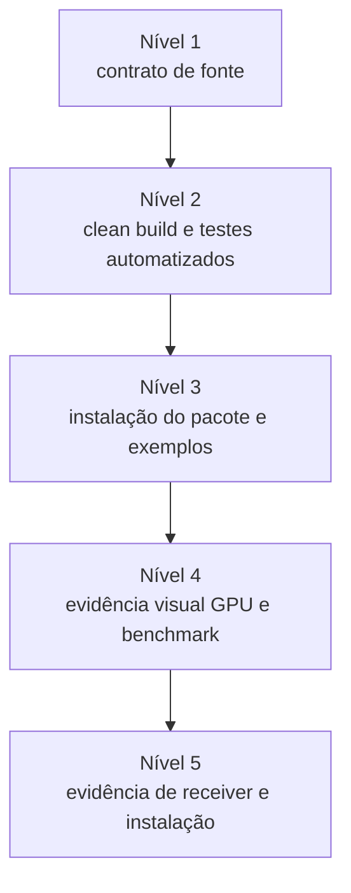

# Software de Pesquisa e Prontidão JOSS

ziviDomeLive é desenvolvido como software de pesquisa open source e artefato técnico-artístico para creative coding, fulldome, mídia imersiva, pesquisa artística e educação.

!!! important "Mapa de prontidão, não status de publicação"
    Esta página mapeia evidências do repositório para preocupações atuais de revisão no estilo JOSS. Não alega submissão, review, aceite, endorsement ou DOI de paper JOSS.

## Proveniência da pesquisa e contexto institucional

A biblioteca surgiu em 2024 no âmbito da pesquisa de doutorado em Artes, na linha de pesquisa Poéticas Tecnológicas do PPGARTES/UFMG, *O domo é vivo: entre técnica, sensível e poética em imersão* ([registro institucional](https://hdl.handle.net/1843/981)). Essa origem situa o software como artefato de pesquisa-criação dedicado às relações entre técnica, experiência sensível, poética e imersão.

Seu contexto de pesquisa atual é o projeto *Arte, Codificação e Imersão: pesquisa-criação, open-source e ecossistemas audiovisuais imersivos*, contemplado no [Edital PIBITI/UFRB nº 05/2026](https://ufrb.edu.br/ppgci/noticias/1624-edital-05-2026-do-pibiti-26-27), ciclo 2026–2027. O projeto é coordenado pelo Prof. Dr. Victor Hugo Soares Valentim e conta com os bolsistas estudantes de graduação **Tiago Silva Rosa** e **David Siqueira de Araujo**, ambos do CECULT/UFRB, como colaboradores. Essa proveniência descreve o contexto institucional da pesquisa; isoladamente, ela não comprova impacto científico, status de publicação ou autoria de uma release específica.

### Registro da pesquisa

- [ficha do projeto no Open Source Science](https://science.ecosyste.ms/projects/36511);
- Victor Hugo Soares Valentim, [*ziviDomeLive como artefato de pesquisa e experimentação em arte e tecnologia para criação de experiências audiovisuais ao vivo em fulldome*](https://files.cercomp.ufg.br/weby/up/777/o/ziviDomeLive_como_artefato_de_pesquisa_e_experimentac%CC%A7a%CC%83o_em_arte_e_tecnologia_para_criac%CC%A7a%CC%83o_de_experie%CC%82ncias_audiovisuais_ao_vivo_em_fulldome.pdf), *Anais do XIII Simpósio Internacional de Inovação em Mídias Interativas — Paradigmas*, Goiânia: Media Lab / Iberoamérica, PPG ACT, 2026, p. 615–628, ISSN 2358-0488;
- [declaração de integridade científica, revisão humana integral e conduta](research-integrity.md), que registra referencial normativo, disclosure de IA e crédito da equipe atual.

## Declaração de necessidade

### Problema

Um artista Processing que trabalha para domo ou imagem esférica precisa coordenar captura multi-view, consistência de estado por frame, conversão de projeção, calibração, lifecycle de cenas/recursos e publicação live opcional. Reimplementar essas fronteiras em cada sketch aumenta o risco de animação dependente de face, erros de contexto gráfico, trabalho background sem limite e stalls de output.

### Audiência

A audiência principal inclui artistas, creative coders, pesquisadores, educadores, estudantes, profissionais de planetário, técnicos de instalação, VJs e developers que desejam um contrato `Scene` orientado ao Processing, não uma API low-level de engine.

### Contribuição

ziviDomeLive oferece:

- um lifecycle de cena em que estado mutável avança uma vez e pode ser renderizado várias;
- domínios independentes Standard e esférico;
- representações finais Standard, Domemaster, Equirectangular e Skybox;
- orientação esférica e calibração física do domemaster;
- serviços de tempo, task, asset, action, câmera, environment e port pertencentes à ativação;
- controle tipado e opt-in de NDI/Syphon/Spout com ownership bounded do runtime;
- exemplos executáveis, qualificação automatizada e protocolos em hardware de destino.

O valor acadêmico/técnico está em tornar essas restrições explícitas e ensináveis no Processing, não em expor um framework OpenGL irrestrito.

## Estado da área

Processing fornece ambiente creative-coding e renderer OpenGL; ecossistemas NDI, Syphon e Spout fornecem transporte/compartilhamento; produção fulldome define necessidades de projeção/calibração. ziviDomeLive compõe essas fronteiras em torno do lifecycle `Scene` do Processing.

Uma submissão JOSS futura ainda precisa de comparação citada e peer-reviewed com bibliotecas fulldome/esféricas Processing e ferramentas creative-coding adjacentes, incluindo justificativa clara de build versus contribute. O repositório não apresenta essa revisão de literatura como completa.

## Matriz de evidências

| Tema de revisão | Evidência no repositório | Estado para submissão futura |
|---|---|---|
| Licença open source | `LICENSE`, `THIRD_PARTY.md`, notices empacotados | Pronto para review |
| Statement of need/audiência | README e esta página | Pronto para review |
| Instalação/dependências | README, Instalação, Gradle/bootstrap e pacote Processing | Pronto; a evidência do pacote instalado é registrada por release |
| Exemplos de uso | Oito sketches de aprendizagem e duas ferramentas de qualificação | Pronto; a execução do pacote instalado é registrada por release |
| Documentação de API | Teste de freeze, Javadocs, níveis da API, guia EN/PT | Pronto para review |
| Testes automatizados | Suítes JUnit, `qualificationTests`, workflows CI | Pronto; totais atuais pertencem à evidência gerada |
| Testes científicos/visuais manuais | Protocolos de calibração/benchmark, checklist de receivers | Protocolo pronto; evidência de hardware incompleta |
| Diretrizes de comunidade | Guia de contribuição, issue tracker, suporte | Pronto para review |
| Citação/autoria | `CITATION.cff`, `.zenodo.json`, DOI/ORCID | Os metadados do DOI do software são versionados e verificáveis externamente |
| Comparação do estado do campo | Gap explícito acima | **Não pronto** |
| Impacto de pesquisa | Política de evidência abaixo | **Não pronto sem evidência externa concreta** |
| Paper de software | Nenhum `paper.md` alegado em 2.0 | **Não submetido** |

## Níveis de reprodutibilidade



### Nível 1 — Contrato

Fonte versionado, snapshot exato da API, testes de lifecycle, validator documental e metadata conservadora.

### Nível 2 — Execução automatizada

Build Java 17 limpo, suítes JUnit/qualification, MkDocs strict, Javadocs e checks determinísticos do pacote em CI.

### Nível 3 — Distribuição Processing

Instalar ZIP/PDEX em sketchbook limpo, abrir `reference/index.html` e compilar/executar os dez exemplos/tools do pacote instalado.

### Nível 4 — Qualificação visual/performance

Registrar ambiente OpenGL, projeção/view, resolução e resultados de calibração; executar BenchmarkTool declarando warm-up, duração e modo de métrica.

### Nível 5 — Interoperabilidade externa

Registrar sender/receiver, OS, arquitetura, runtime, rede e backend exatos para cada claim NDI/Syphon/Spout.

Sucesso em nível inferior nunca implica o superior.

## Política de evidência de impacto

DOI, afiliação ou potencial de uso não são evidência de impacto. Um statement futuro deve citar material concreto e verificável: publicações que usam o software, usuários independentes documentados, integração em pesquisa/ensino, melhorias de benchmark arquivadas ou artefatos reprodutíveis. Até essa evidência ser reunida, o estado honesto é **incompleto**.

## Comunidade, suporte e crédito

- contribua código/testes/docs pelo [Guia de Contribuição](contributing.md);
- reporte problemas reproduzíveis ou busque suporte público em [GitHub Issues](https://github.com/vicvalentim/ziviDomeLive/issues);
- cite o software por [Citação](citation.md) e `CITATION.cff`;
- preserve autoria/crédito conforme a contribuição intelectual real.

## Trabalho assistido por IA e revisão humana integral

O trabalho da versão 2.0 recebeu assistência do OpenAI Codex sob direção do Prof. Dr. Victor Hugo Soares Valentim. A assistência incluiu análise do codebase, apoio à implementação e refatoração, desenvolvimento de testes e documentação e execução dos fluxos de validação. O autor declara ter revisado integralmente o código, a documentação, os testes, os claims técnicos e de pesquisa, as referências e os materiais de release resultantes, compreender e aprovar as decisões finais e assumir responsabilidade humana integral pela pesquisa e desenvolvimento em arte e tecnologia.

O escopo completo, os limites e a base normativa dessa declaração estão em [Integridade Científica, Revisão Humana e Conduta](research-integrity.md). Qualquer paper JOSS futuro precisa de disclosure próprio e completo, acompanhado do procedimento de verificação humana.

## Comandos para reviewers

```bash
./gradlew clean test build
./gradlew qualificationTests
python3 tools/validate_documentation.py --root .
python3 -m mkdocs build --strict
./gradlew buildReleaseArtifacts
python3 tools/validate_documentation.py \
  --root . \
  --package release/ziviDomeLive.zip \
  --release-dir release
```

Evidência de GPU, projetor, benchmark e receiver não pode ser substituída por comando headless.
