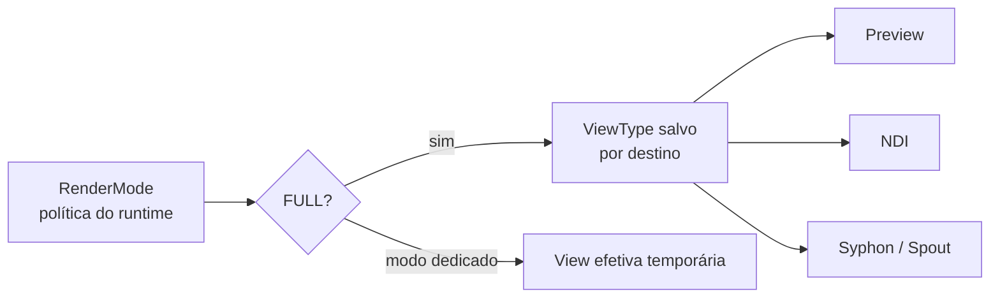

# RenderMode e ViewType

ziviDomeLive separa **como a aplicação está trabalhando agora** de **qual representação um destino recebe**. Manter essas decisões distintas é a chave para um roteamento previsível de preview/output.

- :material-tune-variant: **RenderMode** — *Como quero trabalhar agora?*

    `FULL`, `STANDARD`, `DOMEMASTER`, `EQUIRECTANGULAR`, `SKYBOX`

- :material-routes: **ViewType** — *O que este destino deve receber?*

    `STANDARD`, `DOMEMASTER`, `EQUIRECTANGULAR`, `SKYBOX`

## RenderMode: modo de trabalho atual

`FULL` é o padrão. Ele preserva as rotas independentes de preview e output configuradas por `ViewType`.

Modos dedicados substituem temporariamente a representação efetiva. Eles **não** apagam as rotas armazenadas, que reaparecem ao retornar a `FULL`.

!!! info "Rotas armazenadas sobrevivem aos modos dedicados"
    Mudar para `DOMEMASTER` durante a calibração não destrói o preview Standard nem as seleções de `ViewType` por destino armazenadas para `FULL`.

## ViewType: representação por destino

Em `FULL`, cada destino pode solicitar uma representação final diferente. Um preview Standard pode coexistir, por exemplo, com um output NDI Domemaster sem transformar ambos na mesma rota.

=== "Standard"
    Representação convencional em perspectiva.

=== "Domemaster"
    Representação fisheye circular usada para projeção fulldome.

=== "Equirectangular"
    Representação esférica 2:1 para fluxos 360°.

=== "Skybox"
    Representação em layout de cubemap.

## Um runtime, múltiplos modos

Um modo de renderização não é uma segunda classe de runtime e não substitui a instância `ziviDomeLive`. O modelo público permanece um runtime único com múltiplos modos de trabalho.

[Preview e Output](visual-capture-guide.md){ .md-button .md-button--primary }
[Calibração Esférica](spherical-calibration.md){ .md-button }

