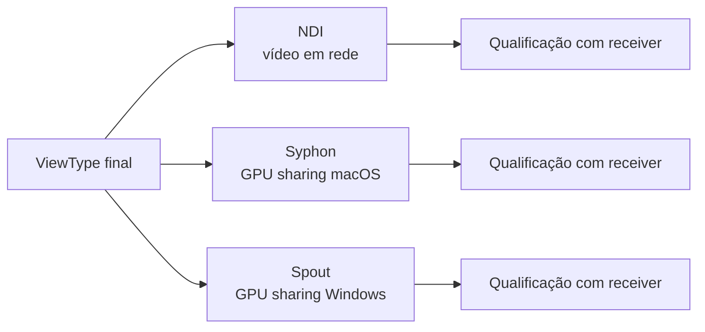

# Outputs Externos

Outputs externos são opcionais. Primeiro escolha **qual representação** o destino deve receber; depois habilite apenas o backend necessário à instalação e verifique seu estado real no receiver.



=== "NDI"

    **O que é?** Output de vídeo em rede.  
    **Plataforma:** a disponibilidade depende de runtime nativo Devolay/NDI compatível e qualificação com receiver.  
    **Selecione uma view:** `setNdiView(ViewType...)`.  
    **Habilite/desabilite:** `setOutputEnabled(OutputType.NDI, boolean)`.

    ```java
    OutputManager outputs = dome.getOutputManager();
    outputs.setNdiView(ViewType.EQUIRECTANGULAR);
    outputs.setOutputEnabled(OutputManager.OutputType.NDI, true);

    println(outputs.getOutputState(OutputManager.OutputType.NDI));
    println(outputs.getOutputFailureReason(OutputManager.OutputType.NDI));
    ```

    !!! tip "Qualificação"
        Teste com um receiver NDI real antes de marcar uma plataforma como qualificada.

=== "Syphon"

    **O que é?** Compartilhamento local de textura GPU no macOS.  
    **Selecione uma view:** `setSyphonView(ViewType...)`.  
    **Habilite/desabilite:** `setOutputEnabled(OutputType.SYPHON, boolean)`.

    Disponibilidade não equivale a inicialização bem-sucedida nem a qualificação com receiver.

=== "Spout"

    **O que é?** Compartilhamento local de textura GPU no Windows.  
    **Selecione uma view:** `setSpoutView(ViewType...)`.  
    **Habilite/desabilite:** `setOutputEnabled(OutputType.SPOUT, boolean)`.

    Teste com um receiver real na configuração Windows que será declarada como qualificada.

## Estado e troubleshooting

Use `getOutputState(...)` e `getOutputFailureReason(...)` para distinguir estados indisponíveis, inicializados/habilitados e falhos. Não deduza a saúde do output apenas pelo toggle da UI.

??? abstract "Por dentro"
    Fronteiras GPU/CPU, filas de worker, buffers, comportamento latest-frame-wins e detalhes de compartilhamento nativo estão em [Backends de Output](../architecture/output-backends.md). Eles não são pré-requisitos para habilitar um output.
