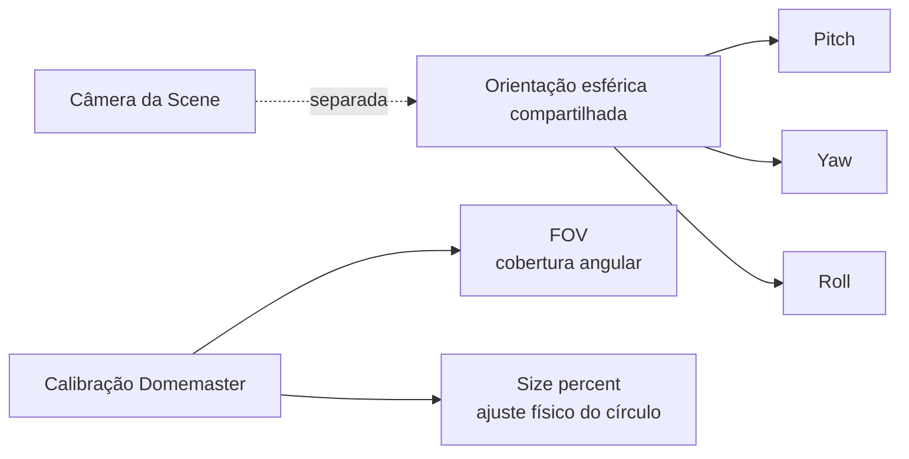

# Calibração Esférica

Pitch/Yaw/Roll, FOV e Size% resolvem **problemas de calibração diferentes**. Mantê-los separados evita confundir orientação, campo de visão e ajuste físico da imagem com o movimento da câmera da Scene.

- :material-axis-arrow: **Pitch / Yaw / Roll**

    Orientam o domínio esférico compartilhado. Não são a câmera da Scene.

- :material-angle-acute: **FOV**

    Define o campo angular representado pelo Domemaster.

- :material-resize: **Size%**

    Ajusta o círculo físico do Domemaster à geometria projetor/lente. Não é zoom da cena.

## Fluxo recomendado

1. Escolha Domemaster.
2. Estabeleça a orientação Pitch/Yaw/Roll.
3. Defina o FOV necessário do Domemaster.
4. Ajuste Size% à geometria óptica/projetor.
5. Verifique o resultado com `CalibrationTool` no sistema de destino.
6. Preserve a calibração ao alterar a resolução de output, salvo quando a própria instalação exigir recalibração.

!!! warning "Size% não é zoom"
    Para mover ou reenquadrar o conteúdo da cena, use o modelo de câmera/navegação da Scene. Size% ajusta a imagem circular Domemaster dentro do target de output.

[Câmera e Navegação](camera-navigation.md){ .md-button }
[CalibrationTool](../qualification/calibration-tool.md){ .md-button .md-button--primary }

