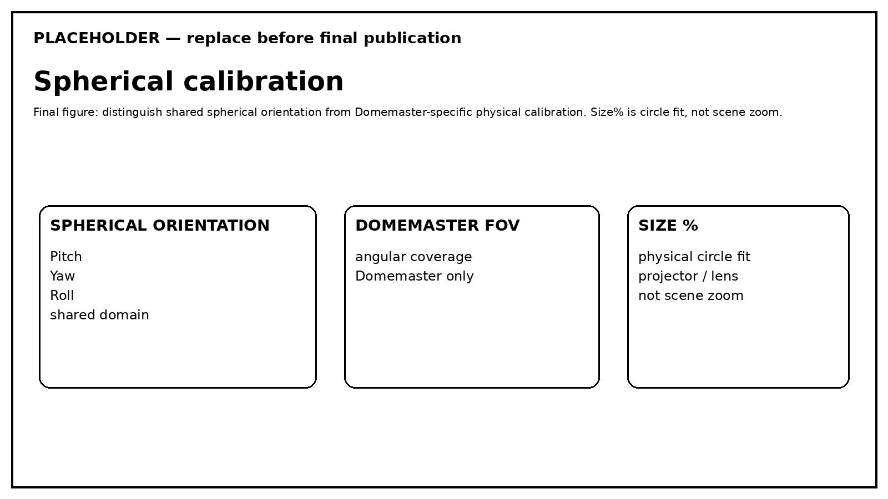

# Calibração Esférica

Os controles esféricos resolvem problemas diferentes e não devem ser reduzidos a um conceito genérico de “zoom/orientação”.

## Pitch / Yaw / Roll

Pitch, Yaw e Roll orientam o **domínio esférico compartilhado** e afetam de forma consistente as representações esféricas.

Eles não são a Scene Camera.

## FOV

FOV é um controle do Domemaster e define o campo angular representado pela saída fisheye.

## Size%

Size% escala fisicamente o círculo Domemaster dentro do target de saída para adequá-lo à geometria de projetor/lente da instalação.

Size% **não é zoom da cena**. Para navegar ou reenquadrar o conteúdo, use o modelo de câmera/cena.

## Fluxo de calibração

1. selecione Domemaster;
2. estabeleça a orientação Pitch/Yaw/Roll;
3. defina o FOV necessário;
4. ajuste Size% à geometria óptica/projetor;
5. verifique com `CalibrationTool` no sistema-alvo;
6. preserve os ajustes ao mudar a resolução de output salvo quando a instalação exigir nova calibração.
